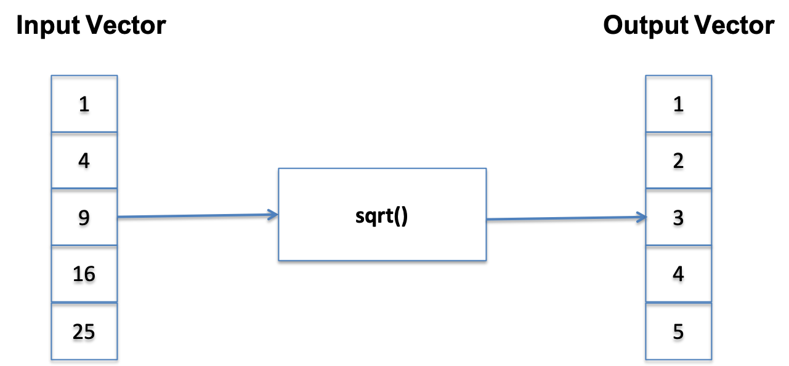
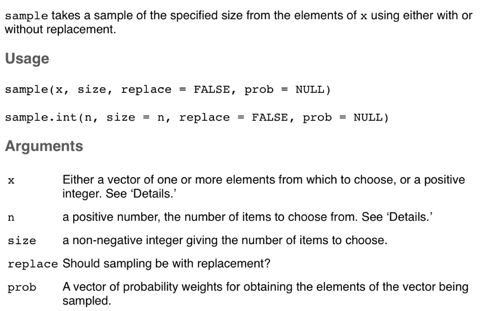

```{r setup, include=FALSE}
knitr::opts_chunk$set(echo = FALSE)
library(ggplot2)
```


## R

- R’s mission is to enable the best and most thorough exploration of data possible (Chambers 2008). 
- It is a dialect of the S language, developed at Bell Laboratories
- ACM noted that S “will forever alter the way people analyze, visualize, and manipulate data” 

  ```{r,echo=T}
v <- 1:10
v
summary(v)
```

## R Studio IDE (also available through https://rstudio.cloud)

```{r, echo=F,out.width='90%',fig.cap='R Studio IDE'}
 knitr::include_graphics("images/01 RStudio.png")
 ```
 

## R Data Types
 
|| Homogenous| Heterogenous |
|:------|:----------|:-----------|
|1d | **Atomic Vector**|List |
|2d | Matrix|Data Frame/Tibble|
|nd | Array| |


- The basic data structure in R is the Vector
- Vectors come in two flavours: 
  + Atomic vectors
  + Lists
- With atomic vectors, all elements have the same type: logical, integer, double (numeric) or character
- **typeof()** **str()** functions useful

## Atomic Vectors - Examples

```{r,echo=T}
dbl_var <- c(2.9, 3.1, 4.8)
typeof(dbl_var)

int_var <- c(0L, 1L, 2L)
typeof(int_var)

log_var <- c(TRUE, TRUE, FALSE, T, F)
typeof(log_var)

str_var <- c("Dublin", "London", "Edinburgh")
typeof(str_var)

```

## str() function useful

```{r,echo=T}
str(dbl_var)

str(int_var)

str(log_var)

str(str_var)

```
</div>
  
  
## Creating Sequences : and seq() function

```{r,echo=T}
v1 <- 1:10
v1
v2 <- 10:20
v2
v3 <- seq(20, 30, by=1)
v3

```

## Creating Vectors of fixed size (in advance)

```{r,echo=T}
v1 <- vector(mode="numeric", length=20)
v1

v2 <- vector(mode="logical", length=5)
v2

```
</div>

## Coercion of atomic vectors
- All elements of an atomic vector MUST be of the same type
- When different type are combined, they will be coerced into the most flexible types


| | **logical** | **integer** | **numeric** | **character** |
|:----|:----|:----|:----|:----|
|**logical**|logical|integer|numeric|character| 
|**integer**|integer|integer|numeric|character| 
|**numeric**|numeric|numeric|numeric|character| 
|**character**|character|character|character|character| 

## Coercion Examples
```{r,echo=T}
v1 <- c(10, 20, TRUE)
v1 
typeof(v1)
v2 <- c(10, 20, "True")
v2 
typeof(v2)
```
  
## Challenge 1.1
Determine the types for each of the following vectors
```{r,echo=T}
v1 <- c(1L, T, FALSE)
v2 <- c(1L, T, FALSE, 2)
v3 <- c(T, FALSE, 2, "FALSE")
v4 <- c(2L, "FALSE")
v5 <- c(0L, 1L, 2.11)
```

## Subsetting Atomic Vectors
- Subsetting data is a key activity in data science
- R’s subsetting operators are powerful and fast
- For atomic vectors, the operator [ is used
- In R, the index for a vector starts at 1

```{r,echo=T}
x <- c( 2.1, 4.2, 3.3, 5.4)
x
x[1]
x[c(1,4)]
```

## Subsetting Vectors - (1) Positive Integer
Positive integers return elements at the specified position

```{r,echo=T}
x <- 1:10
x
x[5]
x[8:10]
```

## Subsetting Vectors - (2) Negative Integer
Negative integers omit elements at specified positions

```{r,echo=T}
x <- 1:10
x
x[-5]
x[-(8:10)]
x[-(2:10)]
```

## Subsetting Vectors - (3) Logical Vectors
- Select elements where the corresponding logical value is TRUE. 
- This approach supports recycling


```{r,echo=T}
x <- 1:5
x
x[c(F,T,T,T,T)]
x[c(F,T)]
```

## Logical Vectors - Can be formed with logical expressions
```{r,echo=T}
x <- 1:5
x
lx <- x < 2
lx
x[lx]
x[x>2]
```
## Subsetting Vectors - (4) Using character vectors
Return elements with matching names
```{r,echo=T}
x <- 1:5
names(x) <- c("a","b","c","d","e")
x
x["a"]
x[c("a","e")]
```

## Challenge 1.2
- Create an R vector of squares of 1 to 10
- Find the minimum
- Find the maximum
- Find the average
- Subset all those values greater than the average

## Vectorisation
- A powerful feature of R is that it supports vectorisation
- Functions can operate on every element of a vector, and return the results of each individual operation in a new vector.
```{r,echo=T}
x <- c(1,4,9,16,25)
x
y <- sqrt(x)
y
```

## Vectorisation 

```{r, echo=F,out.width='90%',fig.cap='Vectorisation in R'}
 
 ```
 
## Vectorised if/else
Vectors can also be processed using the vectorized ifelse(b,u,v) function, which accepts a boolean vector b and allocates the element-wise results to be either u or v. 

```{r,echo=T}
v1 <- 1:5

ans <- ifelse(v1 %% 2 == 0, "Even", "Odd")
ans
```

## Sample Function

```{r, echo=F,out.width='80%',fig.cap='Sample function in Base R'}
 
```

```{r,echo=T}
s <- sample(c("Y","N"),10,prob=c(.2,.8),repl=T)
s
```

## NA Symbol in R (Not available)
- In a project of any size, data is likely to be incomplete due to
  + Missed survey questions
  + Faulty equipment
  + Improperly coded data

- In R, missing data is represented by the symbol NA

```{r,echo=T}
x <- 1:5
x[3] <- NA
x
sum(x)
sum(x, na.rm=TRUE)
```

## Testing for NA? Need **is.na()** function 
- The function is.na() indicates which elements are missing
- Returns a logical vector, the same size as the input vector
```{r,echo=T}
x
is.na(x)
which(is.na(x)) # get the location of NA
x[!is.na(x)] # Exclude all NAs from result
```


## Summary
- Atomic vectors, key type in R
- All elements are the same type (coercion)
- Different ways to filter, including logical vectors
- is.na() to check for symbol NA (not available)
- Vectors support vectorised operations. e.g., **sqrt(1:10)**


```{r,echo=F,fig.width=2, fig.height=2}
# this is a hack to call plot but make the plot tiny
plot(1:1,axes=FALSE,xlab = "", ylab="",cex = .001)
```


