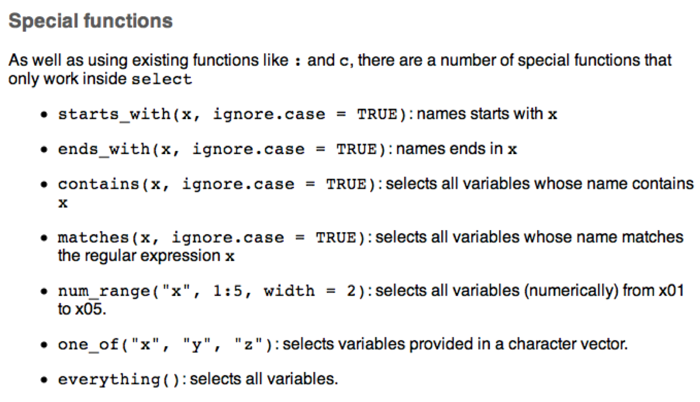

```{r setup, include=FALSE}
knitr::opts_chunk$set(echo = FALSE)
library(ggplot2)
library(dplyr)
```

## Overview

- Visualisation is an important tool for insight generation, but it’s rare that you get the data in exactly the right form you need” (Wickham and Grolemund 2017)
  + Create new variables
  + Create summaries
  + Order data
- dplyr package is designed for data transformation

## dplyr

- All verbs (functions) work similarly
- The first argument is a data frame/tibble
- The subsequent arguments decide what to do with the data frame
- The result is a data frame (supports chaining of steps)

```{r, echo=F,out.width='100%'}
 knitr::include_graphics("images/06 dplyr.png")
```

## Sample Data set ggplot2::mpg
```{r}
glimpse(mpg)
```

## (1) **filter()**
- Subset observations based on their values. 
- First argument the name of the data frame
- Subsequent arguments are expressions that filter the data frame
- Only includes rows that have no missing values

```{r, echo=T}
filter(mpg,manufacturer=="audi",year==1999,model=="a4")
```

## Cars with highest mpg, lowest mpg?

```{r, echo=T}
filter(mpg,hwy==max(hwy))
filter(mpg,hwy==min(hwy))
```

## Challenge 2.1

- List the cars with an average city mpg greater than the median.
- Show the cars with the maximum displacement

## (2) **arrange()**
- Changes the order of rows. 
- Takes a data frame and a set of column names to order by

```{r, echo=T}
arrange(mpg,displ)
```

## Show in descending order

```{r, echo=T}
arrange(mpg,desc(displ))
```

## Add an extra sort column

```{r, echo=T}
arrange(mpg,desc(year),desc(displ))
```

## (3) **select()**
- It is not uncommon to get datasets with hundreds, or even thousands, of variables
- A challenge is to narrow down on the variables of you’re interested in
- select() allows you to rapidly zoom in on a useful subset using operations based on the variable names

```{r, echo=T}
select(mpg,model,year,displ, cty, hwy)
```

## Special Function with select
```{r, echo=F,out.width='100%',fig.cap='Specical functions with select'}
 
```

## (4) **mutate()**
- It is often useful to add new columns that are functions of existing columns
- mutate() always adds new columns at the end of your data set.

```{r, echo=T}
sml <- select(mpg,model,displ,cty)
sml <- mutate(sml,Category=ifelse(cty>mean(cty),"AboveAvr","BelowAvr"))
sml
```

## Useful creation functions
- There are many functions for creating new variables that can be used with mutate()
- The key property is that the function must be vectorised:
  + It must take a vector of values as input, and,
  + Return a vector with the same number of values as output
```{r, echo=F,out.width='80%',fig.cap='Creation functions with mutate()'}
 knitr::include_graphics("images/09 Mutate.png")
```

## (5) **summarise()**
- The last key verb is summarise()
- It collapses a data frame into a single row
- Not very useful unless paired with group_by()
- Very useful to combine with the pipe operator %>%
- The pipe %>% comes from the magrittr package (Stefan Milton Bache)
- Helps to write code that is easier to read and understand
  + x %>% f(y) turns into f(x, y)
```{r, echo=T}
mpg %>% select(model,displ,cty) %>% slice(1:2)
```

## The function **group_by()**
- Most summary data operations are useful done on groups defined by variables in the the dataset.
- The group_by function takes an existing tbl and converts it into a grouped tbl where operations can then performed "by group”.

```{r, echo=T}
gr <- group_by(mpg,year)
agg <- summarise(gr,AverageCty=mean(cty))
agg
```

## Using %>%

```{r, echo=T}
mpg %>% group_by(manufacturer)            %>% 
        summarise(AvrCty=mean(cty),N=n()) %>%
        arrange(desc(AvrCty))             %>%
        slice(1:5)
```

## Overall idea
```{r, echo=F,out.width='85%'}
 knitr::include_graphics("images/11 Overall.png")
```

## Useful Summary Functions
```{r, echo=F,out.width='100%'}
 
```

## The package nycflights13
```{r, echo=T}
glimpse(nycflights13::flights)
```

## Challenge 6.1 | nycflights13::flights
Generate the following graph. Use the variable **dep_delay**. The variable **origin** indicates the departure airport.
```{r, echo=T}
unique(nycflights13::flights$origin)
```

```{r, echo=F,out.width='65%'}
 knitr::include_graphics("images/08 Flights.png")
```

## Summary
- dplyr - a grammar of data manipulation
- Five verbs
  + **filter()**
  + **arrange()**
  + **select()**
  + **mutate()**
  + **summarise()** (along with **group_by()**)
- Usefully combined with **%>%** operator

```{r,echo=F,fig.width=2, fig.height=2}
# this is a hack to call plot but make the plot tiny
plot(1:1,axes=FALSE,xlab = "", ylab="",cex = .001)
```


