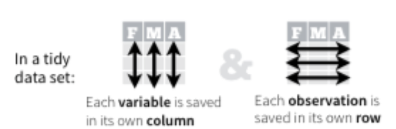

```{r setup, include=FALSE}
knitr::opts_chunk$set(echo = FALSE)
library(ggplot2)
library(dplyr)
library(readxl)
library(tidyr)
library(lubridate)
```

## Relational Data with dplyr

- Typically, data analysis involves many tables of data that must be combined to answer questions
- Collectively, multiple tables of data are called relational data
- Relations are always defined between a pair of tables
- See tibbles **x** and **y**

```{r,echo=F,fig.width=5, fig.height=3}
x = tibble(key=c(1,2,3), 
           val_x = c("x1","x2","x3"))
x
y = tibble(key=c(1,2,4), 
           val_y = c("y1","y2","y3"))
y

```

## Keys
- The variables used to connect each pair of tables are called keys
- A key is a variable (or set of variables) that uniquely identifies an observation
- There are two types of keys:
  + A primary key uniquely identifies an observation in its own table
  + A foreign key uniquely identifies an observation in another table.

```{r, echo=F,out.width='60%'}
 knitr::include_graphics("images/01 Keys.png")
```

## Mutating Joins
- Allows you to combine variables from two tables
- First matches observations by their keys, and then copies across variables from one table to another
- Similar to mutate(), the join functions add variables to the right
- Types
  + Inner Join
  + Left Join
  + Right Join
  + Full Join

## Inner Joins
- Matches pairs of observations when their keys are equal
- Unmatched rows are not included in the result

```{r,echo=T,fig.width=5, fig.height=3}
inner_join(x,y)
```

```{r, echo=F,out.width='40%'}
 knitr::include_graphics("images/02 Base Tables.png")
```

## Left Join
A left join keeps all observations in x

```{r,echo=T,fig.width=5, fig.height=3}
left_join(x,y)
```

```{r, echo=F,out.width='40%',fig.cap='Tables x and y'}
 knitr::include_graphics("images/02 Base Tables.png")
```


## Right Join
A right join keeps all observations in y

```{r,echo=T,fig.width=5, fig.height=3}
right_join(x,y)
```

```{r, echo=F,out.width='40%',fig.cap='Tables x and y'}
 knitr::include_graphics("images/02 Base Tables.png")
```

## Full Join
A full join keeps all observations in x and y

```{r,echo=T,fig.width=5, fig.height=3}
full_join(x,y)
```

```{r, echo=F,out.width='40%',fig.cap='Tables x and y'}
 knitr::include_graphics("images/02 Base Tables.png")
```

## Filtering Joins

Match observations in the same way as mutating joins, but affect the observations, not the variables. Two types:

- semi_join(x,y) keeps all observations in x that have a match in y
- anti_join(x,y), drops all observations in x that have a match in y.


## Semi Joins
Keeps all observations in x that have a match in y

```{r,echo=T,fig.width=5, fig.height=3}
semi_join(x,y)
```

```{r, echo=F,out.width='40%',fig.cap='Tables x and y'}
 knitr::include_graphics("images/02 Base Tables.png")
```

## Anti Joins
Drops all observations in x that have a match in y.

```{r,echo=T,fig.width=5, fig.height=3}
anti_join(x,y)
```

```{r, echo=F,out.width='40%',fig.cap='Tables x and y'}
 knitr::include_graphics("images/02 Base Tables.png")
```


## Summary
- dplyr - support relational data operations
- Mutating Joins
  + **inner_join()**
  + **left_join()**
  + **right_join**
  + **full_join()**
- Filtering Joins
  + **semi_join()**
  + **anti_join()**
- Important for exploratory data analysis and modelling


## Tidy Data - Overview

- What is data tidying?
  + Structuring datasets to facilitate analysis
- The tidy data standard is designed to:
  + Facilitate initial exploration and analysis of data
  + Simplify the development of data analysis tools that work well together
- Principles closely related to relational algebra (Codd 1990)

## Why Tidy Data (Wickham 2017)

- Advantage to picking one consistent way of storing data. Easier to learn tools that work with tidy data because they have a underlying uniformity
- Specific advantage to placing variables in columns because it allows R’s vectorised functions to shine.
- dplyr, ggplot2 designed to work with tidy data

## A Typical Presentation Data Set (Wickham 2014)

```{r, echo=F,out.width='100%'}
 
```

## In R

```{r, echo=T}
untidy <- tibble(name=c("John Smith","Jane Doe",
                        "Mary Johnson"),
                 treatmenta=c(NA, 16, 3),
                 treatmentb = c(2, 11, 1))
untidy
```

## Rules for a Tidy Data Set
- Each variable must have its own column
- Each observation must have its own row
- Each value must have its own cell

```{r, echo=F,out.width='100%'}
 
```

## Problems with the data set
- Treatment types (treatmenta or treatmentb) are column names
- Good for presentation, not for automated analysis
- There are 6 observations, and three variables (Person, Treatment, Outcome)

```{r, echo=T}
untidy
```

## The Goal

```{r, echo=F,out.width='60%'}
 knitr::include_graphics("images/05 Goal.png")
```

## **tidyr** package - 4 key functions

- **gather()** takes multiple columns, and gathers them into key-value pairs: it makes “wide” data longer
- **separate()** splits a single column into multiple columns
- **spread()** takes two columns (key and value) and spreads into multiple columns, it makes long data wider
- **unite()** combines multiple columns into a single column

## The Gather Process

```{r, echo=F,out.width='100%'}
 
```

## Function Call

```{r, echo=F,out.width='100%'}
 
```

## Challenge 3.2
Convert the following data to tidy data format. Process the resulting data using ggplot2 and dplyr.

```{r, echo=F,out.width='100%'}
 
```

## **separate()**
- Separate pulls apart one column into multiple columns
- It splits the information based on finding a non-alphanumeric character
- Separator can be defined (sep=“/”)
- A converter can find best type for the result, if needed.

## Example using tidyr::table3

```{r, echo=F,out.width='100%'}
 knitr::include_graphics("images/09 Separate.png")
```


## **spread()** function
- Spreading is the opposite of gathering
- Useful when observations are scattered across multiple rows
```{r, echo=F}
tidy <- gather(untidy,key=Treatment,value=Outcome,treatmenta:treatmentb)
```
```{r, echo=T}
untidy <- spread(tidy,Treatment,Outcome)
untidy
```

## **unite()**
- The inverse of **separate()**
- Combines multiple columns into a single column
- Can use this to revert the transformed table3 back to its original 
```{r, echo=T}
table3new <- separate(table3, rate, 
                      into=c("cases","population"),
                      convert=T)
table3new
```

## **unite()** - sample code
 
```{r, echo=T}
unite(table3new,"rate", c("cases","population"),
      sep = "/")
```
## Summary
- Tidy Data
  + every row is an obervations
  + Every column a variable
- **tidyr** provides tools to reshape data
- **dplyr** and **ggplot2** operate on tidy data 

```{r,echo=F,fig.width=2, fig.height=2}
# this is a hack to call plot but make the plot tiny
plot(1:1,axes=FALSE,xlab = "", ylab="",cex = .001)
```


