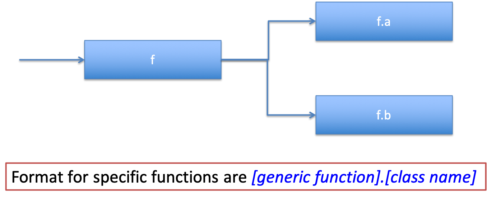
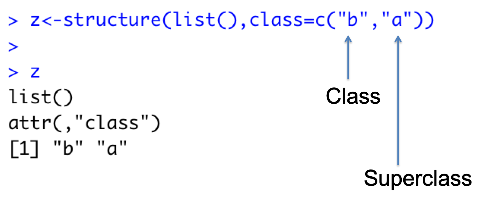

```{r setup, include=FALSE}
knitr::opts_chunk$set(echo = FALSE)
library(ggplot2)
library(dplyr)
library(readxl)
library(tidyr)
library(lubridate)
```

## Attributes in R

- All objects can have arbitrary additional attributes, used to store meta-data about the object
- Attributes can be thought of as a named list (with unique names)
- Attributes can be accessed:
  + Individually with **attr()**
  + All at once with **attributes()**


## Attributes in R

```{r,echo=T}
x <- 1:5
attr(x,"Att1") <- "Hello World"
attr(x,"Att2") <- Sys.time()
x

```

## The **structure()** Function
- The structure function returns a new object with modified attributes 
```{r,echo=T}
x <- structure(1:5,Att1="Hello World",Att2=Sys.time())
x
```

## Properties of Attributes
By default, most attributes are lost when subsetting  a vector

```{r,echo=T}
x <- structure(1:5,Att1="Hello World",Att2=Sys.time())
attributes(x)
attributes(x[1:2])
```

## Attributes that are not removed...
- **Names**, a character vector giving each element a name. names(x)
- **Dimensions**, used to turn vectors into matrices and arrays. dim(x)
- **Class**, used to implement the S3 object system. class(x)
```{r,echo=T}
x <- structure(1:5,names=letters[1:5])
attributes(x)
attributes(x[1:2])
```

## dim()
Can be used to reshape a matrix
```{r,echo=T}
v <- 1:6
v
attr(v,"dim") <- c(2,3)
v
```

## Challenge 8.1
For the vector 1:100, convert this to a 10 x 10 matrix using the attr() function


## The S3 System
- Most OO languages  implement message-passing OO
- Object determines which function to call
  + canvas.drawRect(“blue”)
- S3 Implements generic-function OO
- A special type of function called a generic function decides which method to call (i.e. method dispatch)
  + drawRect(canvas, “blue”)
- S3 is a very casual system, it has no formal definition of classes

## S3
- The only OO system used in the base and stats packages, and the most commonly used in CRAN packages
- “S3 in informal an ad-hoc, but has a certain elegance in its minimalism” (Wickham 2015)
```{r,echo=T}
typeof(mtcars)
class(mtcars)
sloop::otype(mtcars)
```

## S3 Methods
- In S3, methods belong to functions, called generic functions
- S3 methods to not belong to objects or classes
- To determine if a function is an S3 generic, inspect the source code for a call to UseMethod()

```{r,echo=T}
print
```
- UseMethod() – Figures out the correct method to call, the process of method dispatch
- Method names tend to be **generic.class()**

## Showing methods that belong to a generic function
```{r,echo=T}
methods(mean)
length(methods(print))
methods(print)[1:2]
```

## Show generics that have methods for a class
```{r,echo=T}
methods(class="data.frame")
```

## Creating S3 objects
- S3 objects usually built on top of lists, or atomic vectors with attributes
- class(x) shows the class of an object
```{r,echo=T}
o <- list(Name="Test")
str(o)
attr(o,"class") <- "my_class"
str(o)
class(o)
```

## Using **class()**

```{r,echo=T}
o <- list(Name="Test")
class(o) <- "my_class"
str(o)
sloop::otype(o)
```

## Using **structure()**

```{r,echo=T}
o <- structure(list(Name="Test"),class="my_class")
str(o)
class(o)
sloop::otype(o)
```

## Most S3 classes provide a constructor function
```{r,echo=T}
my_class <- function(x){
  structure(list(Name=x),class="my_class")
}
o <- my_class("Test")
class(o)
sloop::otype(o)
```

## Writing methods for S3 - using existing generic functions
```{r,echo=T}
print.my_class <- function (x){
  summary(x)
}

v <- 1:5
print(v)
class(v)<-"my_class"
print(v)
```

## Adding a new generic function
- To add a new generic, create a function that calls UseMethod()
- UseMethod takes two arguments
  + The name of the generic function
  + The argument to use for method dispatch
- If the 2nd argument is omitted, it will dispatch on the first argument to the function
- Methods are then added, using a regular function with the name generic.class


## Overall Idea **f()** is a generic function
```{r, echo=F,out.width='100%'}
 
```

## Example
```{r,echo=T}
f <- function (x){
  UseMethod("f")
}

f.a <- function(x){
  print("This is function f.a()")
}

f.b <- function(x){
  print("This is function f.b()")
}
o <- structure(list(Test=1:2),class="a")
f(o)
```

## Default functions
```{r,echo=T}
f.default <- function(x){
  print("This is function f.default()")
}

o <- structure(list(Test=1:2),class="a")
f(o)
p <- structure(list(Test=1:2),class="c")
f(p)
```


## Challenge 8.2
Write a function that will result in the following behaviour
```{r,echo=F}
summary.data.frame <- function (df){
  print("Hello World")
}
```
```{r,echo=T}
mtcars[1:2,1:5]
summary(mtcars)
```

## Inheritance
The idea of inheritance is to form new classes of specialised versions of existing ones.
```{r, echo=F,out.width='100%'}
 
```

## Example - define two generic functions **f()** and **g()**
```{r,echo=T}
f <- function(x){
  UseMethod("f")
}

g <- function(x){
  UseMethod("g")
}
```

## Create methods for two classes (a and b)
```{r,echo=T}
f.a <- function(x){
  print("Calling method f.a()")
}

f.b <- function(x){
  print("Calling method f.b()")
}

g.a <- function(x){
  print("Calling method g.a()")
}

```

## z is class b, inherits from class a
```{r,echo=T}
z <- structure(1:2, class=c("b","a"))
class(z)
f(z)
g(z)
```

## Challenge 8.3
- Create a new class my_lm that inherits from lm
- Write a summary function for this new class
```{r,echo=F}
my_lm <- function(y, x, d){
  mod <- lm(y ~ x, data=d)
  class(mod) <- c("my_lm", "lm")
  mod
}

summary.my_lm <- function(x){
  print("My Summary will appear here...")
}
```

```{r,echo=T}
ans <- my_lm(faithful$eruptions, faithful$waiting, faithful)
class(ans)
summary(ans)
coefficients(ans)
```
## S3 Summary
- Implements generic-function OO
- A special type of function called a generic function decides which method to call (i.e. method dispatch)
- S3 is a very casual system, it has no formal definition of classes
- Inheritance can be used to leverage existing R S3 classes


```{r,echo=F,fig.width=2, fig.height=2}
# this is a hack to call plot but make the plot tiny
plot(1:1,axes=FALSE,xlab = "", ylab="",cex = .001)
```


