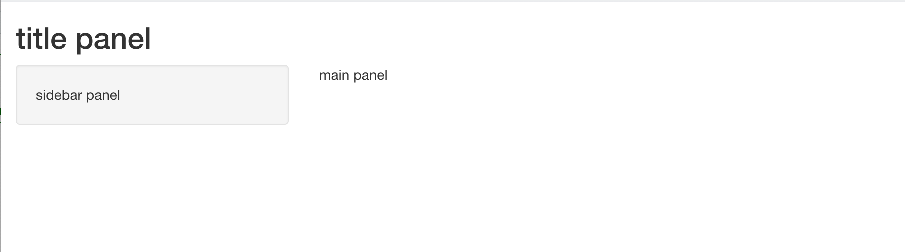
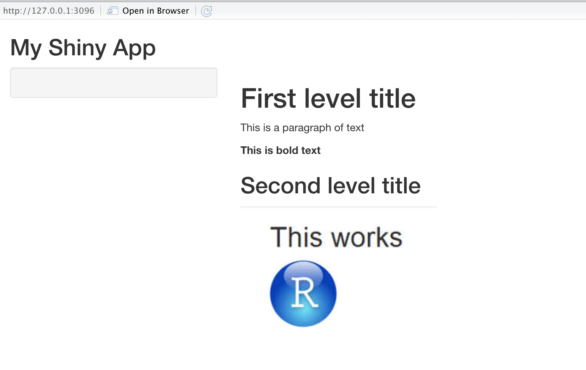
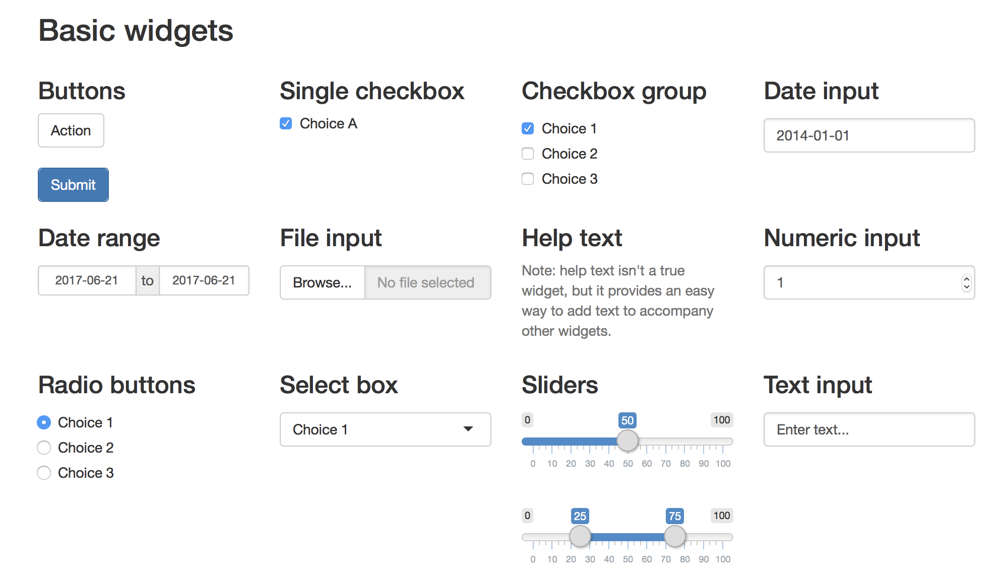
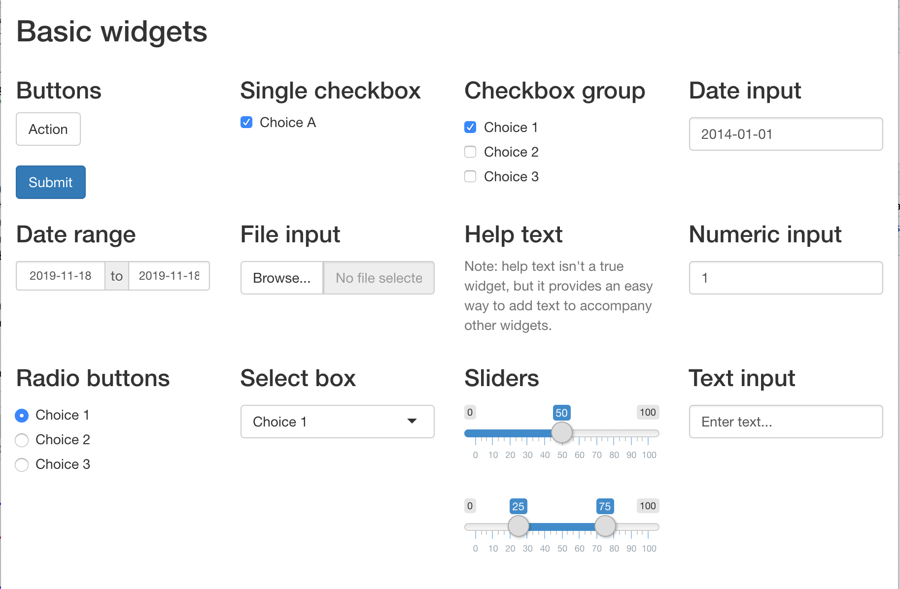
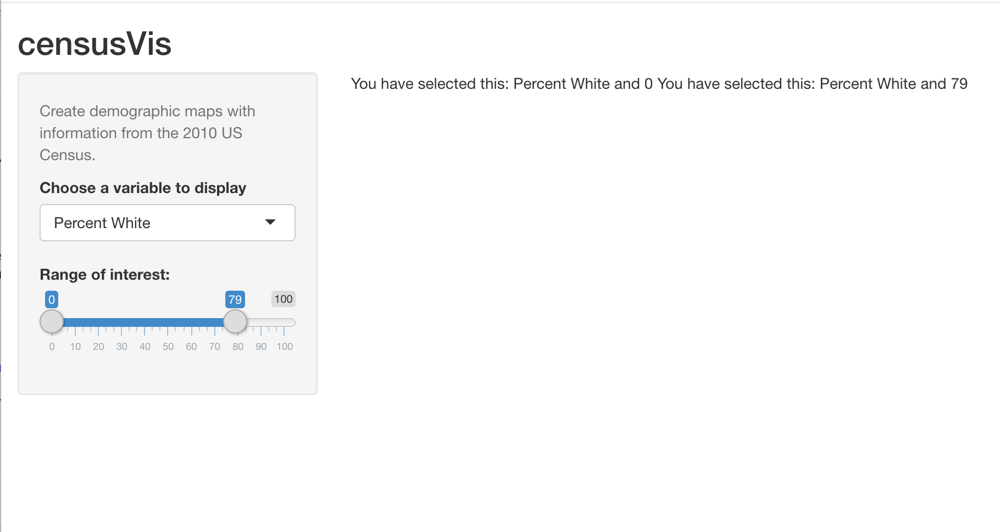
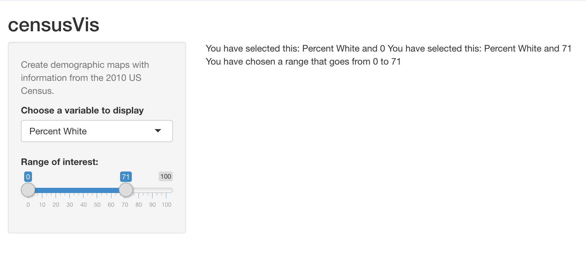
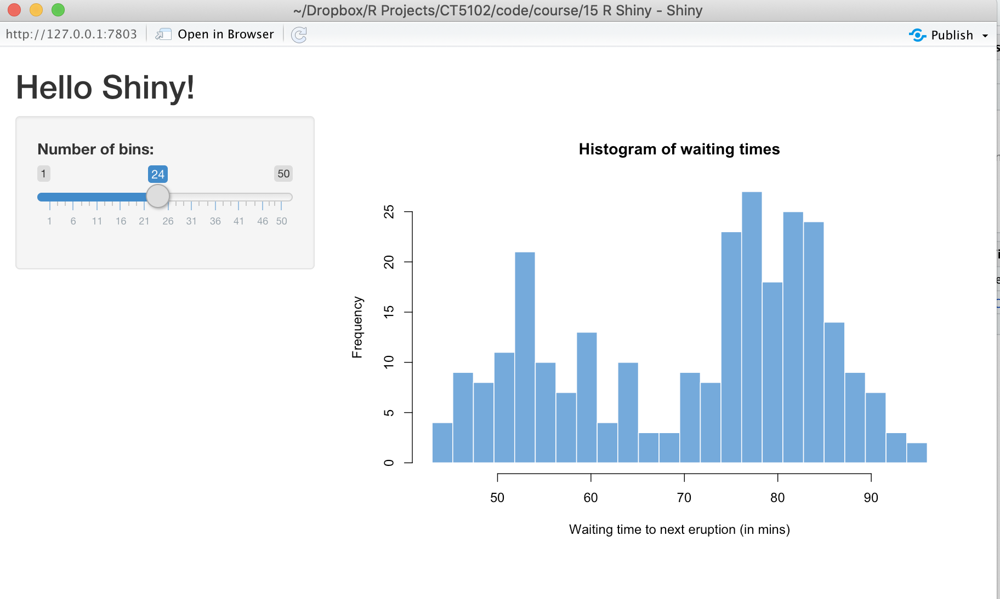
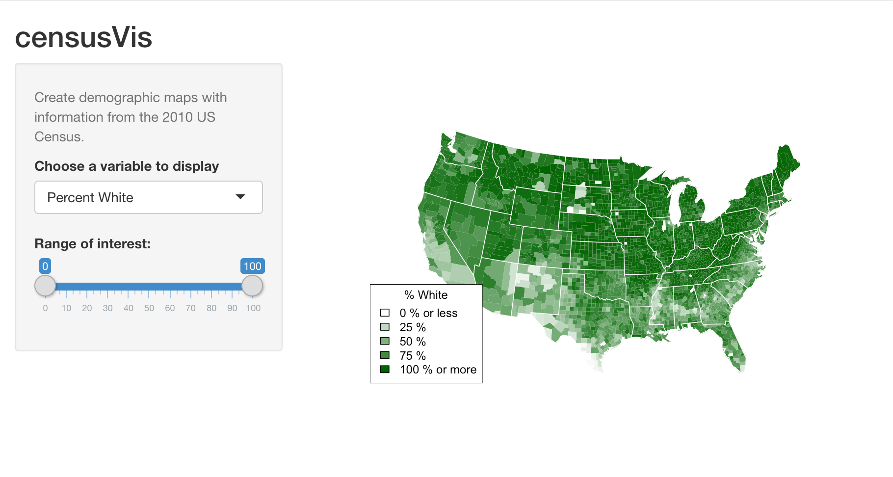
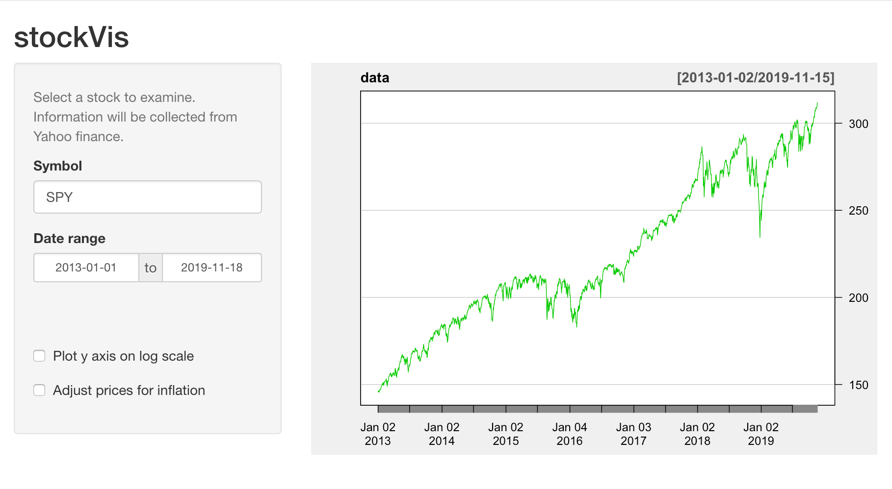
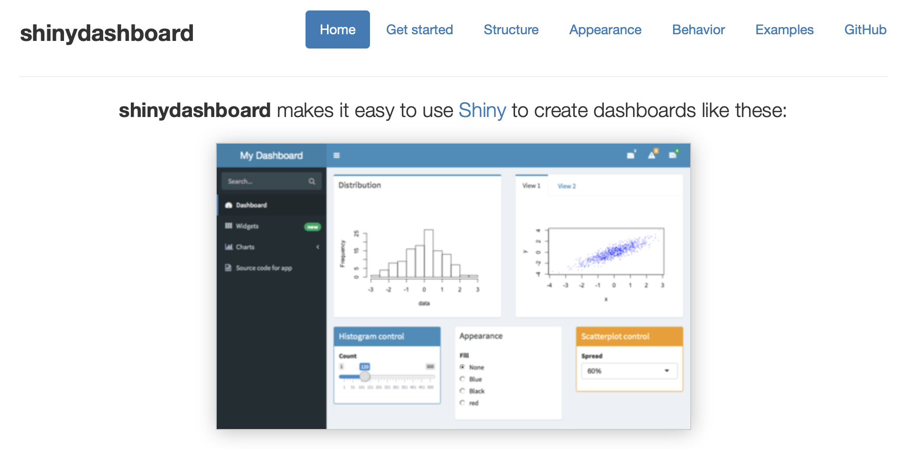

```{r setup, include=FALSE}
knitr::opts_chunk$set(echo = FALSE)
library(shiny)
```

## [RShiny Overview](https://shiny.rstudio.com/tutorial/written-tutorial/lesson1/)

- Shiny is an R package that makes it easy to build interactive web applications (apps) straight from R.
- Shiny apps are contained in a single script called app.R. 
- The script app.R lives in a directory, app.R has three components:
  + a user interface object, which controls the layout and appearance of your app
  + a server function contains the instructions that your computer needs to build your app
  + a call to the shinyApp function, creates Shiny app objects from an explicit UI/server pair

## Basic Template

```{r,echo=T, eval=F}
library(shiny)

# Define UI ----
ui <- fluidPage(
  
)

# Define server logic ----
server <- function(input, output) {
  
}

# Launch app
shinyApp(ui = ui, server=server)
```

## Layout
- Shiny uses the function fluidPage to create a display that automatically adjusts to the dimensions of your user’s browser window. 
- You lay out the user interface of your app by placing elements in the fluidPage function.
- For example, the ui function below creates a user interface that has a title panel and a sidebar layout, which includes a sidebar panel and a main panel. Note that these elements are placed within the fluidPage function.
```{r,echo=T, eval=F}
ui <- fluidPage(
  titlePanel("title panel"),

  sidebarLayout(
    sidebarPanel("sidebar panel"),
    mainPanel("main panel")
  )
)
```

## Run file - 01 Layout.R
- **titlePanel** and **sidebarLayout** are the two most popular elements to add to **fluidPage**
- They create a basic Shiny app with a sidebar
- **sidebarLayout** always takes two arguments
  + **sidebarPanel** function output
  + **mainPanel** function output
```{r, echo=F,out.width='90%'}
 
```


## HTML Content
- Content can be added by placing it inside a Panel function
- For more advanced content, Shiny's HTML tag functions can be used. These functions parallel common HTML5 tags, e.g.

|Shiny Function| HTML5 Equivalent| Creates |
|:------|:----------|:-----------|
|p |\<p\>|A paragraph of text |
|h1 |\<h1\>|A first level header|
|h2..h6 |\<h2\>..\<h6\>|Lower level headers|
| a| \<a\>|A hyperlink |
| HTML| |Directly passes a character string as HTML code |
```{r,echo=T, eval=T}
h3("Hello World")
```

## HTML Example
```{r,echo=T, eval=F}
ui <- fluidPage(
  titlePanel("My Shiny App"),
  sidebarLayout(
    sidebarPanel(),
    mainPanel(
      h1("First level title"),
      p("This is a paragraph of text"),
      strong("This is bold text"),
      br(),
      h2("Second level title"),
      img(src="RStudio.jpg")
    )
  )
)
```

## Output

```{r, echo=F,out.width='90%'}
 
```

## Adding Control Widgets
```{r, echo=F,out.width='90%'}
 
```

## Running Code Example
```{r, echo=F,out.width='90%'}
 
```

## Display Reactive Output
- Build reactive output to displays in yoru Shiny app
- Shiny provides a familiy of functions that turn R objects into output for your UI

|Output Function| Creates|
|:------|:----------|
|dataTableOutput |DataTable|
|htmlOutput      |raw HTML|
|imageOutput |image|
|plotOutput |plot|
|tableOutput|table|
|textOutput|text|
|uiOutput |raw HTML|
|verbatimTextOutput |text|

## See file 04 Output.R
```{r, echo=F,out.width='100%'}
 
```

## See file 05 Output.R
```{r, echo=F,out.width='100%'}
 
```


## Reactive Summary

- use an *Output function in the ui to place reactive objects in your Shiny app,
- use a render* function in the server to tell Shiny how to build your objects,
- surround R expressions by curly braces, {}, in each render* function,
- save your render* expressions in the output list, with one entry for each reactive object in your app, and
- create reactivity by including an input value in a render* expression.

## User Interface Object (1/2)

```{r,echo=T, eval=F}
ui <- fluidPage(
  titlePanel("Hello Shiny!"),
  
  # Sidebar layout with input and output definitions ----
  sidebarLayout(
    # Sidebar panel for inputs ----
    sidebarPanel(
      
      # Input: Slider for the number of bins ----
      sliderInput(inputId = "bins",
                  label = "Number of bins:",
                  min = 1,
                  max = 50,
                  value = 30)
      
    ),
```
  
## User Interface Object (2/2)  
```{r,echo=T, eval=F}
    # Main panel for displaying outputs ----
    mainPanel(
      
      # Output: Histogram ----
      plotOutput(outputId = "distPlot")
      
    )
  )
)
```

## Server Function (1/2)  
```{r,echo=T, eval=F}
server <- function(input, output) {
  
  # Histogram of the Old Faithful Geyser Data ----
  # with requested number of bins
  # This expression that generates a histogram 
  # is wrapped in a call to renderPlot to indicate 
  # that:
  #
  # 1. It is "reactive" and therefore should be automatically
  #    re-executed when inputs (input$bins) change
  # 2. Its output type is a plot
  output$distPlot <- renderPlot({
    
    x    <- faithful$waiting
    bins <- seq(min(x), max(x), length.out = input$bins + 1)
    
    hist(x, breaks = bins, col = "#75AADB", border = "white",
         xlab = "Waiting time to next eruption (in mins)",
         main = "Histogram of waiting times")
    
  })
  
}
```

## Server Function (2/2)  
```{r,echo=T, eval=F}

shinyApp(ui = ui, server = server)
```

## Running the App

```{r, echo=F,out.width='100%'}
 
```

## Observations
- At one level, the Hello Shiny server function is very simple. 
- The script does some calculations and then plots a histogram with the requested number of bins.
- However, most of the script is wrapped in a call to renderPlot. This gets called every time the slider button changes value


## Run the app
shinyApp(ui = ui, server = server)


## Challenge
- Replicate Lesson 5 from online tutorial
- https://shiny.rstudio.com/tutorial/written-tutorial/lesson5/
- counties.rds
  + Name of each county in the US
  + Total population
  + Percentage residents who are White, Black, Hispanic or Asian.
  
  
## Maps Output
```{r, echo=F,out.width='100%'}
 
```
  
## Reactive Expressions
- Reactive expressions let you control which part of the apps to update when
- Prevents unnecessary computation that can slow down your app.
```{r, echo=F,out.width='80%'}
 
```

## The Server Logic
```{r,echo=T, eval=F}
server <- function(input, output) {
  
  output$plot <- renderPlot({
    
    data <- getSymbols(input$symb, src = "yahoo",
               from = input$dates[1],
               to = input$dates[2],
               auto.assign = FALSE)
    
    chartSeries(data, theme = chartTheme("white"),
                type = "line", log.scale = input$log, 
                TA = NULL)
  })
  
}
```

## A Problem
- Every time we resize change the y-axis scale, renderPlot() is called
- Two actions
  + Fetches the data from Yahoo finance with **getSymbols()**
  + Redraws the chart with the corrected axis
- Not good, as we have to re-fetch the data ti re-draw the plot
- Unnecessary work (and Yahoo server might disconnect as you begin to look like a bot)
- Solution - reactive expressions

## A Reactive Expression
- A reactive expression is an R expression that uses a widget and returns a value
- The reactive expression will update this value whenever the original widget changes
- To create a reactive expression, use the reactive function, which takes an R expression surrounded by braces

## Coding the solution

```{r,echo=T, eval=F}
server <- function(input, output) {
  dataInput <- reactive({
    getSymbols(input$symb, src = "yahoo",
               from = input$dates[1],
               to = input$dates[2],
               auto.assign = FALSE)
  })
  
  output$plot <- renderPlot({
    
    chartSeries(dataInput(), theme = chartTheme("white"),
                type = "line", log.scale = input$log, 
                TA = NULL)
  })
  
}
```

## Summary - Reactive Expression
- A reactive expression saves its result the first time you run it
- The next time the reactive expression is called, it checks if the saved value has become out of date (i.e. whether the widgets it depends on has changed)
- If the value is out of date, the reactive object will recalculate it (and then save the new result)
- If the value is up-to-date, the reactive expression will return the saved value without doing any computation


## RShiny Summary
- Useful way to provide a web interface
- See https://shiny.rstudio.com

```{r, echo=F,out.width='100%'}
 
```


```{r,echo=F,fig.width=2, fig.height=2}
# this is a hack to call plot but make the plot tiny
plot(1:1,axes=FALSE,xlab = "", ylab="",cex = .001)
```


