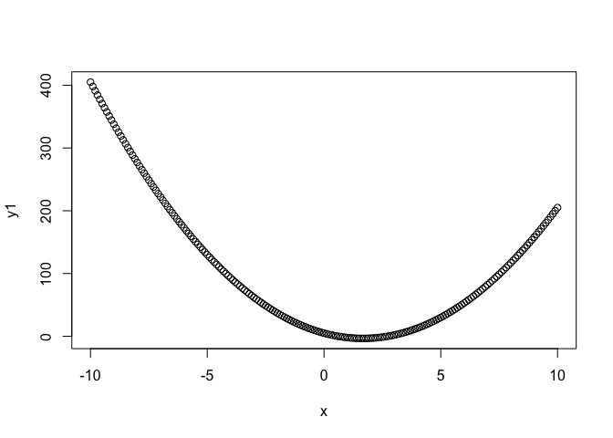

Lecture 3 (Matrices and Functions) - Summary
================

<!-- README.md is generated from README.Rmd. Please edit that file -->
Here are some of the key points from the lecture. See also the sample code solutions in the code folder.

-   The ... operator is useful for capturing additional parameters that are sent to a function. These can also be forwared to other functions.

``` r
# The ... operator can be examined in a function by using it to create a list
test_dot <- function(...){
  list(...)
}

test_dot(1:2, 3:4, c(T,F))
```

    ## [[1]]
    ## [1] 1 2
    ## 
    ## [[2]]
    ## [1] 3 4
    ## 
    ## [[3]]
    ## [1]  TRUE FALSE

``` r
# The ... operator can be used to capture additional parameters and forward these to other functions
mysum <- function(v,...){
  sum(v,...)
}

x <- c(1,2,3,4, NA)

mysum(x)
```

    ## [1] NA

``` r
mysum(x,na.rm=T)
```

    ## [1] 10

-   do.call() can be used to call a function with arguments that are specified in a list

``` r
args <- list(c(1:10,NA), na.rm = TRUE)

ans <- do.call(sum,args)
```

-   Replacement functions can be used to modify the argument. Examples in R include names(), diag(), and dim()

``` r
v <- 1:12
v
```

    ##  [1]  1  2  3  4  5  6  7  8  9 10 11 12

``` r
dim(v) <- c(3,4)
v
```

    ##      [,1] [,2] [,3] [,4]
    ## [1,]    1    4    7   10
    ## [2,]    2    5    8   11
    ## [3,]    3    6    9   12

-   Replacement functions can also be written.

``` r
`second<-` <- function(y, value) {
  x[2] <- value
  x
}
x <- 1:10
second(x) <- 500L
x
```

    ##  [1]   1 500   3   4   5   6   7   8   9  10

-   Matrices can be created from vectors, and are filled in column order (by default)

``` r
v <- 1:12
v
```

    ##  [1]  1  2  3  4  5  6  7  8  9 10 11 12

``` r
m <- matrix(v,nrow = 3,ncol=4)
m
```

    ##      [,1] [,2] [,3] [,4]
    ## [1,]    1    4    7   10
    ## [2,]    2    5    8   11
    ## [3,]    3    6    9   12

-   Matrices can have rows and columns named

``` r
v <- 1:12
v
```

    ##  [1]  1  2  3  4  5  6  7  8  9 10 11 12

``` r
m <- matrix(v,nrow = 3,ncol=4)
rownames(m) <- letters[1:3]
colnames(m) <- LETTERS[1:4]
m
```

    ##   A B C  D
    ## a 1 4 7 10
    ## b 2 5 8 11
    ## c 3 6 9 12

-   Matrices can be subsetted by row or by column. Leaving a blank will display either all rows or all columns

``` r
m
```

    ##   A B C  D
    ## a 1 4 7 10
    ## b 2 5 8 11
    ## c 3 6 9 12

``` r
# show first two rows and all columns
m[1:2,]
```

    ##   A B C  D
    ## a 1 4 7 10
    ## b 2 5 8 11

``` r
m
```

    ##   A B C  D
    ## a 1 4 7 10
    ## b 2 5 8 11
    ## c 3 6 9 12

``` r
# show first two columns and all rows
m[,1:2]
```

    ##   A B
    ## a 1 4
    ## b 2 5
    ## c 3 6

-   Matrices can be subsetted by row or column name

``` r
m
```

    ##   A B C  D
    ## a 1 4 7 10
    ## b 2 5 8 11
    ## c 3 6 9 12

``` r
# show first two columns and all rows
m[,c("B","C")]
```

    ##   B C
    ## a 4 7
    ## b 5 8
    ## c 6 9

-   A functional is a function that takes a function as an input and returns a vector as output. Commonly used in R to iterate over data. The apply family of functions are very useful, for example, lapply(x,f,args)

``` r
l <- list(1:2, 3:4, 5:6)
lapply(l,max)
```

    ## [[1]]
    ## [1] 2
    ## 
    ## [[2]]
    ## [1] 4
    ## 
    ## [[3]]
    ## [1] 6

``` r
sapply(l,max)
```

    ## [1] 2 4 6

-   Anonymous functions can also be written

``` r
x <- seq(-10,10,by = 0.1)

a <- 3
b <- -10
c <- 5

y1 <- lapply(x, function(x){
  a*x^2+b*x+c
})

plot(x,y1)
```



-   The apply function can be used to process matrices on a row by row (paramter=1), or a column by column basis (parameter =2)

``` r
set.seed(10)
N=10

cs1 <- rnorm(N,72,10)
cs2 <- rnorm(N,65,7)
cs3 <- rnorm(N,80,9)
cs4 <- rnorm(N,55,7)
cs5 <- rnorm(N,61,5)

m   <-cbind(cs1, cs2, cs3, cs4, cs5)

m <- cbind(m, avr=apply(m,1,mean))
m
```

    ##            cs1      cs2      cs3      cs4      cs5      avr
    ##  [1,] 72.18746 72.71246 74.63320 42.02382 66.43276 65.59794
    ##  [2,] 70.15747 70.29047 60.33242 54.45438 57.18728 62.48440
    ##  [3,] 58.28669 63.33237 73.92621 61.77996 56.85669 62.83638
    ##  [4,] 66.00832 71.91211 60.92845 56.29448 65.17237 64.06315
    ##  [5,] 74.94545 70.18973 68.61322 45.34039 56.16174 63.05011
    ##  [6,] 75.89794 65.62543 76.63705 44.95140 60.85592 64.79355
    ##  [7,] 59.91924 58.31539 73.81200 57.53461 62.16263 62.34877
    ##  [8,] 68.36324 63.63395 72.15057 42.68639 59.49396 61.26562
    ##  [9,] 55.73327 71.47865 79.08415 52.72819 57.61193 63.32724
    ## [10,] 69.43522 68.38085 77.71598 50.43906 64.27614 66.04945
