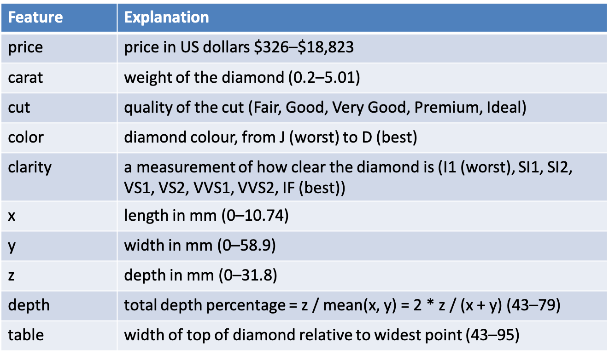
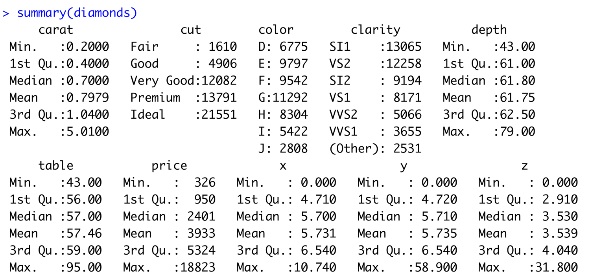

```{r setup, include=FALSE}
knitr::opts_chunk$set(echo = FALSE)
library(ggplot2)
library(dplyr)
```

## Data Exploration

“Data exploration is the art of looking at your data, rapidly generating hypotheses, quickly testing them, then repeating again and again and again.” (Wickham and Grolemund 2017).

```{r, echo=F,out.width='100%',fig.cap='Exploring Data'}
 knitr::include_graphics("images/01 DE.png")
```


## Data visualisation with **ggplot2**

“The simple graph has brought more information to the data analyst’s mind that any other device.” – John Tukey 

```{r,echo=T}
d <- ggplot2::mpg  # get a copy of mpg
glimpse(d)  # show structure and some data
```

## Fuel Economy Data Set (ggplot2::mpg)

This dataset contains a subset of the fuel economy data that the EPA makes available on http://fueleconomy.gov. It contains only models which had a new release every year between 1999 and 2008 - this was used as a proxy for the popularity of the car.

|**manufacturer**| car manufacturer| **drv** | drive type |
|:------|:----------|:-----------|:-----------|
|**model**| model name| **cty** | city miles per gallon |
|**displ**| engine disp (l)| **hwy** | highway miles per gallon |
|**year**| year of make| **fl** | fuel type |
|**model**| model name| **cty** | city miles per gallon |
|**cyl**| number of cylinders| **class** | "type" of car |
|**trans**| type of transm.|  | |

## Exploring Data
Generate a first graph to help answer the following question

- Do cars with big engines use more fuel than cars with small engines
- What might the relationship between engine size and fuel efficiency look like?
  + Positive or negative?
  + Linear or non-linear?
- Variable (scatter plot)
  + **displ**, a car engine size in litres (x)
  + **hwy**, a car's fuel efficiency on highway - (y)

## Plotting with ggplot2

```{r,echo=T,fig.width=5, fig.height=2.5}
ggplot(data = d) +   # specify the source tibble
  geom_point(mapping=aes(x=displ,  # map x, y vars
                         y=hwy))
```

## Adding a linear model

```{r,echo=T,fig.width=5, fig.height=2.5}
ggplot(data = d,aes(x=displ, y=hwy)) +  
  geom_point() +
  geom_smooth(method = "lm")
```

## Interpreting the plot
- The plot shows a negative relationship between engine size (displ) and fuel efficiency (hwy)
- Cars with big engines use more fuel
- Does this confirm or refute your hypothesis about fuel efficiency and engine size?
```{r,echo=F,fig.width=4, fig.height=2.1}
ggplot(data = d,aes(x=displ, y=hwy)) +  
  geom_point() +
  geom_smooth(method = "lm")
```

## Challenge 5.1
- Explore the hypothesis that city driving is less fuel efficient that highway driving
- Use ggplot to present the points on the same graph, and colour each data set differently
- Does the data confirm or refute your initial hypothesis?

```{r,echo=T,fig.width=3, fig.height=1.5}
ggplot(data = d) +  
  geom_point(mapping=aes(x=displ,  
                         y=hwy),colour="blue")
```

## Aesthetic Mappings
- A third variable can be added to a 2-D plot by mapping it to an aesthetic.
- An aesthetic is a visual property of the plot’s objects.
- An aesthetic’s level could be colour, size or shape


```{r,echo=T}
unique(d$class)
```

## In ggplot2 - Adding the third variable
```{r,echo=T,fig.width=5, fig.height=2.5}
ggplot(data=d)+
  geom_point(aes(x=displ,y=hwy,colour=class))
```

## Exploring Data Relationships
|Input (X)| Output (Y)| Hypothesis?|Reason |
|:------:|:----------|:----------|:----------|
|Displacement| City MPG| Negative? |Bigger cars,less efficient|
|Highway MPG| City MPG| Positive? |Should be closely related |
|Cylinders| Highways MPG| Negative? |More cylinders, less eff.|
|Cylinders| Displacement| Negative? |More cylinders, bigger eng.|

## x=displ, y=cty
```{r, echo=T,fig.width=5, fig.height=2.3}
ggplot(data = mpg) +   # specify the source tibble
  geom_point(mapping=aes(x=displ,  # map x, y vars
                         y=cty))
```

## x=hwy, y=cty
```{r, echo=T,fig.width=5, fig.height=2.3}
ggplot(data = mpg) +   # specify the source tibble
  geom_point(mapping=aes(x=hwy,  # map x, y vars
                         y=cty))
```

## x=cyl, y=cty
```{r, echo=T,fig.width=5, fig.height=2.3}
ggplot(data = mpg) +   # specify the source tibble
  geom_point(mapping=aes(x=cyl,  # map x, y vars
                         y=cty))
```

## x=cyl, y=displ
```{r, echo=T,fig.width=5, fig.height=2.3}
ggplot(data = mpg) +   # specify the source tibble
  geom_point(mapping=aes(x=cyl,  # map x, y vars
                         y=displ))
```

## Challenge 5.2
- Redraw the graphs, and colour by **car class**
- Vary the size of the point by using the number of cylinders

|Input (X)| Output (Y)| Hypothesis?|Reason |
|:------:|:----------|:----------|:----------|
|Displacement| City MPG| Negative? |Bigger cars,less efficient|
|Highway MPG| City MPG| Positive? |Should be closely related |
|Cylinders| Highways MPG| Negative? |More cylinders, less eff.|
|Cylinders| Displacement| Negative? |More cylinders, bigger eng.|


## Facets
- Another way to add categorical variables is to split a plot into facets, subplots that display one subset of the data.
- To facet your plot by a single variable, use facet_wrap(), with ~ followed by the variable name
- To facet on the combination of two variables, used facet_grid()

## Facet Example 1
```{r,echo=T,fig.width=4.5, fig.height=2.5}
ggplot(data=d)+
  geom_point(aes(x=displ,y=hwy))+
  facet_wrap(~class)
```

## Facet Example 2
```{r,echo=T,fig.width=4.5, fig.height=2.5}
ggplot(data=d)+
  geom_point(aes(x=displ,y=hwy,colour=class))+
  facet_wrap(~manufacturer)
```

## Facet Grid Example
```{r,echo=T,fig.width=4.5, fig.height=2.5}
ggplot(data=d)+
  geom_point(aes(x=displ,y=hwy))+
  facet_grid(drv~cyl)
```

## Geoms
- A geom is a geometrical object that a plot uses to represent data
- Bar charts use bar geoms, line charts use line geoms, and scatter plots use the point geom.
- To change the geom in your plot, simply change the geom function that is added to the ggplot call.

## Same data - geom 1
```{r,echo=T,fig.width=4.5, fig.height=2.5}
ggplot(data=d)+
  geom_smooth(aes(x=displ,y=hwy))
```

## Same data - geom 2
```{r,echo=T,fig.width=4.5, fig.height=2.5}
ggplot(data=d)+
  geom_point(aes(x=displ,y=hwy))
```


## Sample plot geoms
```{r, echo=F,out.width='90%'}
 knitr::include_graphics("images/02 Geoms.png")
```

## Diamonds Data Set
A dataset containing the prices and other attributes of almost 54,000 diamonds

```{r,echo=F}
knitr::kable(
  slice(ggplot2::diamonds,1:10),
  caption="Selected sample from diamonds data set"
)
```


## Explanation of Variables

```{r, echo=F,out.width='100%'}
 
```


## Diamonds summary
```{r, echo=F,out.width='100%'}
 
```

## Statistical Transformations
- Many graphs, like scatterplots, plot the raw values of the dataset

- However, other graphs (e.g. bar charts) calculate new values to plot
  + Bar charts, histograms and frequency polygons bin your data and plot bin counts, the number of points that fall in each bin
  + Smoothers fit a model to your data and the plot predictions from the model
  + Boxplots compute a robust summary of the distribution and display a specially formatted box

## Bar Chart

```{r,echo=T,fig.width=4.5, fig.height=2.5}
ggplot(data=diamonds)+
  geom_bar(aes(x=cut))
```

## Bar Chart: Adding information with fill

```{r,echo=T,fig.width=4.5, fig.height=2.5}
ggplot(data=diamonds)+
  geom_bar(aes(x=cut,fill=clarity))
```

## Bar Chart: Normalising Plot

```{r,echo=T,fig.width=4.5, fig.height=2.5}
ggplot(data=diamonds)+
  geom_bar(aes(x=cut,fill=clarity),position="fill")
```

## Bar Chart: side-by-side

```{r,echo=T,fig.width=4.5, fig.height=2.5}
ggplot(data=diamonds)+
  geom_bar(aes(x=cut,fill=clarity),position="dodge")
```

## Additional Adjustment
- Recall our first scatterplot
- 126 points displayed, yet there are 234 observations
- Many points can overlap, so it makes it hard to see where the mass of data is
- Are all points spread equally, or is there one special combination that contains 129 values?
- “jitter” adds random noise to each point

## Using jitter

```{r,echo=T,fig.width=4.5, fig.height=2.5}
ggplot(data=mpg)+
  geom_point(aes(x=displ,y=hwy),
           colour="blue", position="jitter")
```

## Histogram

```{r,echo=T,fig.width=5, fig.height=2.5}
ggplot(data=diamonds,aes(x=price))+
  geom_histogram(binwidth = 500)
```


## Boxplot
- Display the distribution of a continuous variable broken down by a categorical variable
- Box that stretches from the 25th to 75th percentile a distance known as the interquartile range (IRQ)
- Median in the middle of box
- Points outside more that 1.5 times the IQR from either edge of the box are displayed (outliers)
- Whisker extends to the farthest non-outlier point in the distribution 

## Boxplot Example

```{r,echo=T,fig.width=5.5, fig.height=3}
ggplot(data=mpg,aes(x=class,y=hwy))+
  geom_boxplot()
```

## Summary
- The ggplot2 approach can be summarised by a template
- It can take seven parameters, but usually not all need to be applied (defaults used)
- These seven parameters comprise the **grammar of graphics**

```{r, echo=F,out.width='50%'}
 knitr::include_graphics("images/05 Layered.png")
```

```{r,echo=F,fig.width=2, fig.height=2}
# this is a hack to call plot but make the plot tiny
plot(1:1,axes=FALSE,xlab = "", ylab="",cex = .001)
```

