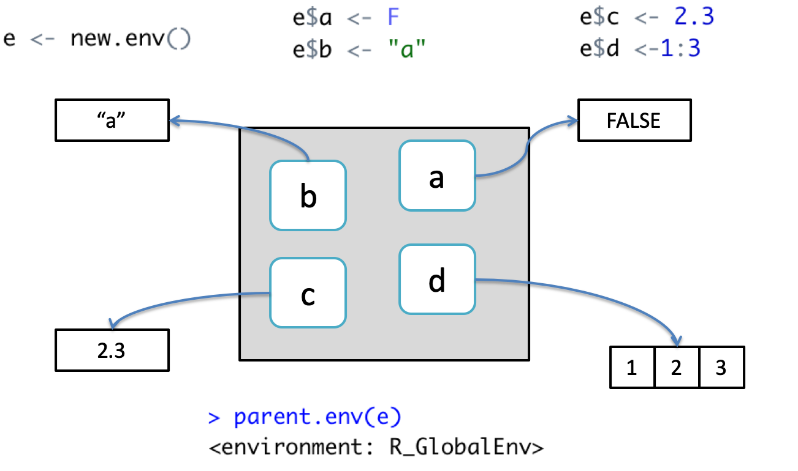
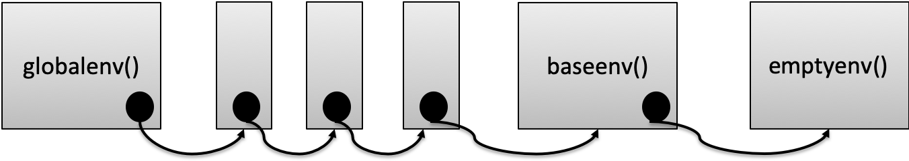
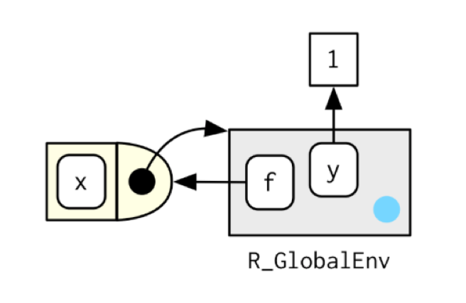
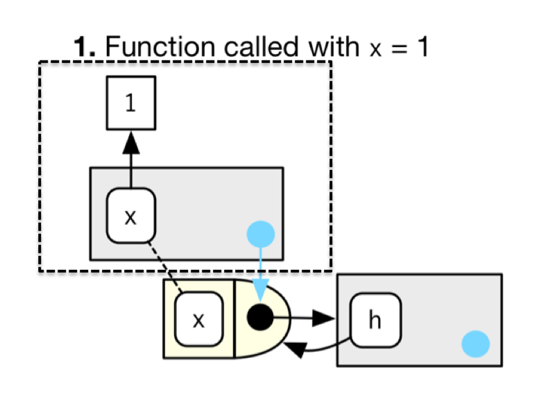
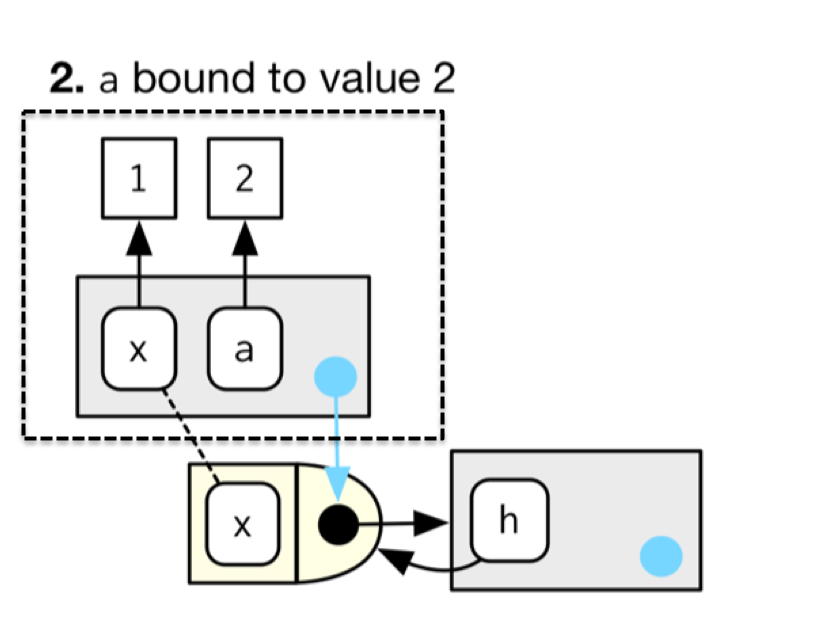
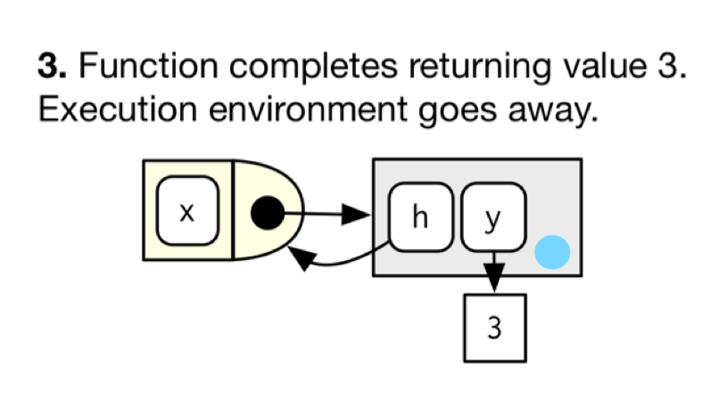
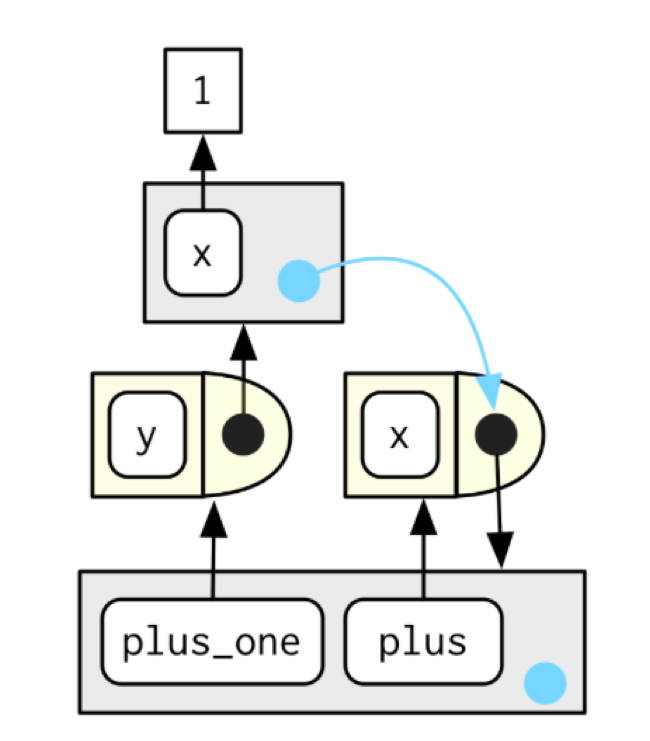
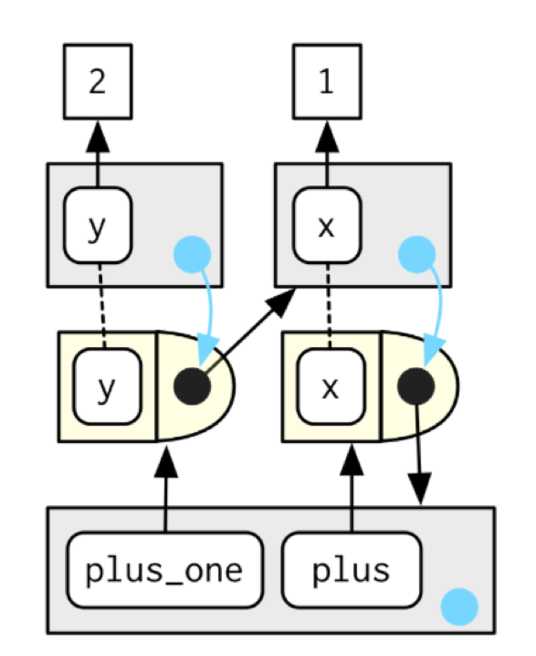
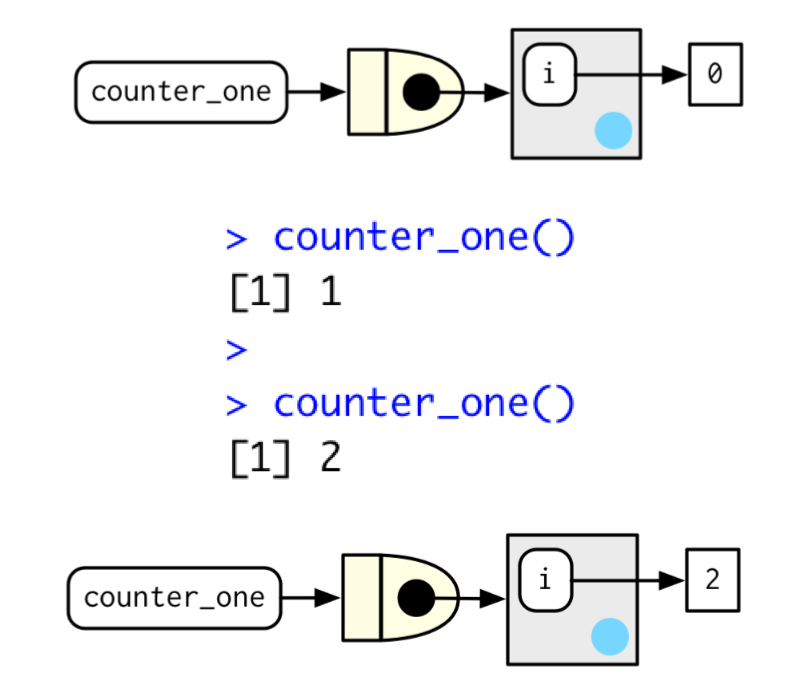

```{r setup, include=FALSE}
knitr::opts_chunk$set(echo = FALSE)

```

## Overview
- Environments
- Function Environments
- Closures 

## Environment Basics
- The job of an environment is to associate a set of names to a set of values (a bag of names) (Wickham 2015)
- Each name points to an object stored elsewhere in memory

```{r, echo=F,out.width='80%'}
 
```

## Useful Definition
- Environments can be thought of as consisting of two things: a frame, which is a set of symbol-value pairs, and an enclosure, a pointer to an enclosing environment. 
- When R looks up the value for a symbol the frame is examined and if a matching symbol is found its value will be returned. 
- If not, the enclosing environment is then accessed and the process repeated. 
- Environments form a tree structure in which the enclosures play the role of parents. The tree of environments is rooted in an empty environment, available through emptyenv(), which has no parent.

## Properties of an environment
Generally, an environment is similar to a list, with four exceptions:

- Every object in an environment has a unique name
- The objects in an environment are not ordered
- An environment has a parent
- Environments have reference semantics: When you modify a binding in an environment, the environment is not copied; it’s modified in place

## There are 4 Special Environments
- **globalenv()** is the interactive workspace. The parent of this is the last package attached with library() or require()
- **baseenv()** is the environment of the base package
- **emptyenv()** is the ultimate ancestor of all environments, and the only one without a parent
- **environment()** is the current environment
```{r,echo=T}
environment()
```

## The Search Path

```{r, echo=F,out.width='100%'}
 
```
```{r,echo=T}
search()
```

## Searching Environments

```{r,echo=T}
library(pryr)
where("mean")
where("faithful")
```

## Accessing data in other environments
- Code that exists at a certain level of the environment has at least read access to all the variables the level above it
- However, direct write access to variables at higher levels via the standard <- operator is not possible
```{r,echo=T}
y <- 100
f <- function()y<-200
f()
y
```

## Double arrow assignment operator
- The operator will search up the environment hierarchy, stopping at the first level the name is encountered
- If no name is found, the variable is assigned at the global level
```{r,echo=T}
y <- 100
f <- function()y<<-200
f()
y
```

## Function Environments
- A function binds the current environment when it is created. 
- In diagrams, functions are depicted as rectangles with a rounded end that binds an environment
```{r, echo=F,out.width='50%'}
 
```

```{r,echo=T}
y <- 1
f <- function(x)x+y
```

## Execution Environments
- Each time a function is called, a new environment is created to host execution
- The parent of the execution environment is the enclosing environment of the function
- Once the function is completed, this execution environment is discarded
```{r,echo=T}
h <- function(x){
  a <- 2
  x + a
}
y <- h(1)
```

## Step 1
```{r,echo=T}
h <- function(x){
  a <- 2
  x + a
}
y <- h(1)
```
```{r, echo=F,out.width='50%'}
 
```

## Step 2
```{r,echo=T}
h <- function(x){
  a <- 2
  x + a
}
y <- h(1)
```
```{r, echo=F,out.width='50%'}
 
```

## Step 3
```{r,echo=T}
h <- function(x){
  a <- 2
  x + a
}
y <- h(1)
```
```{r, echo=F,out.width='60%'}
 
```

## Function Factories
- A function factory is a function that makes functions
- The enclosing environment of the child function is the execution environment of the parent
- Therefore, the execution environment is no longer *ephemeral*
```{r,echo=T}
plus <- function(x){
  print(environment())
  function(y)x+y
}
plus_one <- plus(1)
rlang::fn_env(plus_one)
```

## Visualising the "manufactured" function
```{r, echo=F,out.width='40%'}
 
```

```{r,echo=T}
plus <- function(x){
  function(y)x+y
}
plus_one <- plus(1)
```

## Calling plus_one(2)
```{r, echo=F,out.width='40%'}
 
```

```{r,echo=T}
plus_one(2)
```

## Exploring the enclosing environment of a manufactured function

```{r,echo=T}
plus <- function(x){
  function(y)x+y
}
plus_one <- plus(1)

ls(env=rlang::fn_env(plus_one))
rlang::fn_env(plus_one)$x
```

## Doing some interesting things...

```{r,echo=T}
my_power <- function(exp){
  function(x)x^exp
}
f1 <- my_power(2)
f1(2)
rlang::fn_env(f1)$exp <- 3
f1(2)
```

## Closures
- “An object is data with functions. A closure is a function with data.” John D. Cook.
- Anonymous functions can be used to create closures, functions written by functions
- Closures can also be created by returning a list of functions from a function
- Closures get their name because the enclose the environment of the parent function and can then access all its variables
- Along with the double assignment arrow operator, it can provide mutable state

## Mutable State Example
```{r,echo=T}
new_counter <- function(){
  i <- 0
  function(){
    i <<- i+1
    i
  }
}
counter_one <- new_counter()
counter_one()
counter_one()
```


## Visualising the process
```{r, echo=F,out.width='60%'}
 
```

## Multiple functions as part of a closure using list()
```{r,echo=T}
counter <- function(init){
  i <- init
  list(increment=function(v=1)i<<-i+v,
       decrement=function(v=1)i<<-i-v,
       show=function()i)
}
c1 <- counter(10)
c1$increment()
c1$show()
c1$decrement(11)
c1$show()
```

## Summary
- Role of environments in R
- For a function
  + The enclosing environment
  + The execution environment
- Function factories and mutable state


```{r,echo=F,fig.width=2, fig.height=2}
# this is a hack to call plot but make the plot tiny
plot(1:1,axes=FALSE,xlab = "", ylab="",cex = .001)
```


