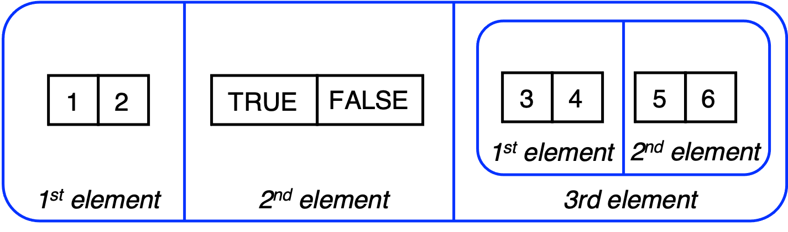

```{r setup, include=FALSE}
knitr::opts_chunk$set(echo = FALSE)
library(ggplot2)
```


## R

- R’s mission is to enable the best and most thorough exploration of data possible (Chambers 2008). 
- It is a dialect of the S language, developed at Bell Laboratories
- ACM noted that S “will forever alter the way people analyze, visualize, and manipulate data” 
- See [https://github.com/JimDuggan/CT5102](https://github.com/JimDuggan/CT5102)

```{r,echo=T}
x <- 2 + 3
x
```

## Vectors

> The vector type is really the heart of R. It's hard to imagine R code, 
> or even an interactive R session, that doesn't involve vectors.
>
> --- Norman Matloff "The Art of R Programming"
 
## Overview

- A vector is a one-dimensional data structure in R
- There are two types of vectors: **atomic vectors**, where all the data must be of the same type, and **lists**, which are more flexible and each element's type can vary. 
- Learning outcomes:
    + The difference between an atomic vector and a list, and be able to create atomic vectors and lists using the `c()` and `list()` functions.
    + The four main types of atomic vector, and how different vector elements can be named.
    + The rules of coercion for atomic vectors, and the importance of the function `is.na()`
    + The idea of vectorisation, and how arithmetic and logical operators can be applied to vectors.
    + Key R functions that allow you to work with vectors.
    + How to solve all three challenges

## Atomic Vectors

- The *atomic vector* is a powerful one-dimensional data structure that allows you to store one or more values. 
- Note that unlike other languages, there is no special variable in R for storing a single value. 
- A single variable (often called a *scalar*) in R is simply an atomic vector of size 1. 
- For atomic vectors all of the elements must be of the same type.
- In order to create an atomic vector, the function `c()` is used (short for combine).
- When assigning a value to a variable, R's *right-to-left* assignment operator `<-` should be used
- There are 4 main types: **double**, **integer**, **logical** and **character**

```{r,echo=T}
v1 <- c(2.9, 3.1, 4.8)
v1
```

## Some useful functions
 
* `typeof()`, which shows the variable type, which will be one of the four categories.
* `str()`, which compactly displays the internal structure of a variable, and also shows the type. This is a valuable function that you will make extensive use of in R, particularly when you are exploring data returned from functions.
* `is.logical()`, is.double()`, `is.integer()`, and `is.character()`  which tests the variable's type, and returns `TRUE` if the type matches the function name.

  
## Logical type
* **Logical**, where values can be either `TRUE` or `FALSE`
* The abbreviations `T` and `F` can also be used. 
* For example, here we declare a logical vector with five elements. 

```{r,echo=T}
x_logi <- c(TRUE, T, FALSE, TRUE, F)
x_logi

typeof(x_logi)

str(x_logi)

```
  
## Integer type  
* **Integer**, which represent whole numbers (negative and positive), and must be declared by appending the letter `L` to the number. 
* `L` is that it is an abbreviation for the word *long*, which is used to define integers in R. 

```{r, echo=T}

# Create an integer vector
x_int <- c(2L, 4L, 6L, 8L, 10L)
x_int

typeof(x_int)

str(x_int)
```
  
  
## Double type   
* **Double** represents floating point numbers.  
* Note that integer and double vectors are also known as numeric vectors

```{r, echo=T}
# Create a double vector
x_dbl<- c(1.2, 3.4, 7.2, 11.1, 12.7)

x_dbl

typeof(x_dbl)

str(x_dbl)
```

## Character type 
* **Character**, which represents values that are in string format.
```{r, echo=T}
x_chr<- c("One","Two","Three","Four","Five")

x_chr

typeof(x_chr)

str(x_chr)

```
  
## Appending atomic vectors
```{r,echo=T}
# Create vector 1
v1 <- c(1,2,3)
# Create vector 2
v2 <- c(4,5,6)

# Append for vector 3
v3 <- c(v1, v2)
v3

# Append for vector 4
v4 <- c(v2, v1)
v4
```

## Creating larger vectors
* While the `c()` function creates atomic vectors, there may be cases where a larger atomic vector needs to be constructed, and there are a number of additional ways that can be used for this.

* The colon operator `:` which generates a regular sequence as an atomic vector, from a starting value to the end of a sequence. The function `length()` can also be used to confirm the number of elements in the atomic vector.

```{r,echo=T}
x <- 1:10

x

typeof(x)
length(x)

```

  
## The seq() function
* The sequence function `seq()`, generates a regular sequence from a starting value (`from`) to a final value (`to`).
* It also allows for an increment between each value (`by`), and for a fixed length for the vector to be specified (`length.out`). 
* Note that when calling a function in R such as the `seq` function , the argument name (i.e. `from`)can be used when passing a value, this is useful, as it means we don't need to know that exact positioning of the argument in the parameter list.

## seq() Examples
```{r,echo=T}
(x0 <- seq(1,10))

(x1 <- seq(from=1, to=10))

(x2 <- seq(from=1, to=5,by=.5))

(x3 <- seq(from=1, to=5,by=2))

(x4 <- seq(length.out=10))
```


## The rep() function
* The replication function `rep()` replicates values contained in the input vector, a given number of times.

```{r, echo=T}
# use rep to initialise a vector to zeros
z1 <- rep(0,10)
z1

# use rep to initialise with a pattern of values
z2 <- rep(c("A","B"),5)
z2
```

## Creating Vectors of fixed size (in advance)
* The  `vector()` function creates a vector of a fixed length, and initialises each vector element
* This can be useful for creating larger vectors in advance of carrying out processing operations on each individual element. 
```{r, echo=T}
(y1 <- vector("logical",   length = 3))

(y2 <- vector("integer",   length = 3))

(y3 <- vector("double",   length = 3))

(y4 <- vector("character", length = 3))
```


## Coercion of atomic vectors
- All elements of an atomic vector **MUST** be of the same type
- When different type are combined, they will be coerced into the most flexible types


| | **logical** | **integer** | **numeric** | **character** |
|:----|:----|:----|:----|:----|
|**logical**|logical|integer|numeric|character| 
|**integer**|integer|integer|numeric|character| 
|**numeric**|numeric|numeric|numeric|character| 
|**character**|character|character|character|character| 

## Coercion Examples 1
```{r, echo=T}
(ex1 <- c(T,F,T,7L))
typeof(ex1)

(ex2 <- c(T,F,T,7.3))
typeof(ex2)
```
  
## Coercion Examples 2
```{r, echo=T}
(ex3 <- c(1L,2L, 3L, 4.1))
typeof(ex3)

(ex4 <- c(TRUE,1L,2.0, "Hello"))
typeof(ex4)
```
    
  
## Naming Atomic Vectors

* A highly useful feature of R is that vector elements (both atomic vectors and lists) can be named
* Names are an *attribute* of vectors. 
* There are a number of ways to name vector elements, and the simplest is to declare the name of each element as part of the `c()` function, using the `=` symbol. 
* Note that the names do not have any impact on manipulating the data.
```{r, echo=T}
# Create a double vector with named elements
(x_dbl<- c(a=1.2, b=3.4, c=7.2, d=11.1, e=12.7))
```

## Extracting the names
* A character vector of the element names can be easily extracted using a special R function called `names()` 
* First, we can see how the element names are extracted.

```{r,echo=T}
# Extract the names of the x_dbl vector
x_dbl_names <- names(x_dbl)

typeof(x_dbl_names)

x_dbl_names

```

## Setting names using the `names()` function
* `names()` can act as an *accessor function*, that will return the names of the vector elements
* It can also be used to set the names of a vector.

```{r, echo=T}
# Show our previously defined vector x_logi
x_logi

# Allocal names to each vector element
names(x_logi) <- c("f","g","h","i","j")
x_logi

```

## Missing Values - Introducing *NA*
* When analysing data, it is common that there will be missing values. 
* For example, a sensor such as a thermometer might break down on any given day, and so an hourly temperature recording could be missed. 
* In R, `NA` - short for *not applicable* - is a logical constant of length one which contains a missing value indicator. 

```{r,echo=TRUE}
(v <- 1:5)

v[5] <- NA

v
```

## Are there NAs in a vector?
* How can we check whether `NA` is present in a vector? 
* The function `is.na()` is used
* It returns returns a logical vector showing whether an `NA` value is present at a given location

```{r,echo=TRUE}
v
(is.na(v))
# sum the vector, why is the answer NA?
sum(v)
```

## NAs get in the way!
* The presence of an `NA` value causes difficulty for what should be straightforward calculation. 
* This obstacle can be overcome by adding an additional argument to the `max()` function which is `na.rm=TRUE`
* R then ignores all the `NA` values 

```{r, echo=T}
v
sum(v)
(sum(v, na.rm = TRUE))
```

## Vectorisation {#ch2-vectorisation}
* Vectorisation is a powerful feature of R 
* A function can operate on all the elements of an atomic vector, and return all the results in new atomic vector, of the same size.
* We have:
  + input atomic vector of size $N$ with elements $x_{1},x_{2},x_{3},...,x_{N}$
  + a vectorised function $f(x)$ that will (1) create an output atomic vector of size $N$ of the appropriate type (it does not have to be the same type as the input), and (2) loop through each element, apply the code, and store the result in the output vector $f(x_{1}),f(x_{2}),f(x_{3}),...,f(x_{N})$ 


```{r, ch02-vect, fig.cap='Vectorisation in R',echo=FALSE}

```

## A vectorised example `sqrt()`
- Many of R's functions are vectorised, which means that they perform the same operation on each data element, and store the result in a new vector. 
- The function `sqrt()` is a nice example of a vectorised function, as it takes in a vector of numbers, and calculates the square root of each individual number. This is shown in the following code.

```{r,echo=T}
# Set the random number seed to 100
set.seed(100)
# Create a sample of 5 numbers from 1-10. 
(v <- sample(1:10,5))
(sv <- sqrt(v))
```


## Arithmetic Operators 
* Similar to other programming languages, R has arithmetic, relational and logical operators. 
* R's main arithmetic operators are shown below.
* Note, in cases where two vectors are of unequal length, R has a *recycling* mechanism, where the shorter vector will be recycled in order to match the longer vector

| R Arithmetic Operator   | Description      |
| :---                    | :---             |
| `+`                     | Addition         |
| `-`                     | Subtraction      |
| `*`                     | Multiplication   |
| `/`                     | Division         |
| `%/%`                   | Integer division |
| `**`  or `^`            | Exponentiation   |
| `%%`                    | Modulus          |

## Arithemic Operators - 1
```{r,echo=TRUE}
(v1 <- c(10, 20, 30))
(v2 <- c(2, 4, 3))

v1 + v2
v1 - v2

v1 * v2
v1 / v2

v1 ^ v2

v1 %/% 7
v1 %% 7
```

## Arithemic Operators - 2
```{r,echo=TRUE}
v1 / v2

v1 ^ v2

v1 %/% 7
v1 %% 7
```

## Relational Operators
- Relational operators allow for comparison between values, and *always return a logical vector*. 
- The output from the use of a relational operator is a logical atomic vector that is the same size as the input vector, and every value contains the result of the logical operation applied to the corresponding element
- There are six categoires of relation operators, as shown in this table.


| R Relational Operator    | Description               |
| :---                     | :---                      |
| `<`                      | Less than                 |
| `<=`                     | Less than or equal to     |
| `>`                      | Greater than              |
| `>=`                     | Greater than or equal to  |
| `==`                     | Equal to                  |
| `!=`                     | Not equal to              |


## Relational Operator Examples - 1
```{r, echo=T}
# Setup a test vector
(v5 <- c(5,1,4,2,6,8))

v5 < 4
v5 <= 4
v5 > 4
v5 >= 4
v5 == 4
v5 != 4
```

## Relational Operator Examples - 2
```{r, echo=T}
v5

v5 == 4
v5 != 4

# Recycling also works
v5 == c(5,8)
```

## Summarising Relational Operator Results
- Relational operators can take advantage of R's coercion rules, can be conveniently used with the `sum()` function
- Logical values are coerced  to ones or zeros. 
- For example, we can see how many vector elements are greater than the mean.

```{r, echo=T}
(v6 <- 1:7)

l_test <- v6 > mean(v6)
l_test

sum(l_test)
```

## Logical Operators
* Logical operators perform logical operations, for example `AND` and `NOT`
* For atomic vectors, the following logical operators can be used.

| R Logical Operator  | Description                                                                |
| :---                | :---                                                                       |
| `!`                 | Logical NOT: Converts TRUE to FALSE, or FALSE to TRUE                      |
| `&`                 | Logical AND: TRUE if all relational expressions are TRUE, otherwise FALSE  |
| `|`                 | Logical OR: TRUE if any relational expression is TRUE, otherwise FALSE     |

## Logical Operator Example
```{r, echo=T}
set.seed(200)
(v  <- sample(1:20, 5, replace = T))

v >= 10 & v <= 14

v < 5 | v > 17

!(v %% 2 == 0)
```

## ifelse() vectorisation
The `ifelse()` function allows for successive elements of an atomic vector to be processed with the same conditional logic. The general form of the function is `ifelse(test_condition, true_value, false_value)`, where:

* `test_condition` is a logical vector, or an operation that yields a logical vector, such as a logical operator
* `true_value` is the new vector value if the condition is true
* `false_value` is the new vector value if the condition is false

```{r, echo=T}
(v <- 1:5)
(test <- ifelse(v %% 2 == 0,"Even","Odd"))

```

## Mini-Case: Two-dice rolls with Atomic Vectors
 
Our goal is to simulate this, and check the proportions with N=1000

| Dice Rolls                      | Probability | Sum   | Proportion |
| :---                            | :---        | :---  | :---       |
| (1,1)                           | 1/36        |  2    | 0.02777778 |
| (1,2)(2,1)                      | 2/36        |  3    | 0.05555556 |
| (1,3)(3,1)(2,2)                 | 3/36        |  4    | 0.08333333 |
| (1,4)(4,1)(2,3)(3,2)            | 4/36        |  5    | 0.1111111  |
| (1,5)(5,1)(2,4)(4,2)(3,3)       | 5/36        |  6    | 0.1388889  |
| (1,6)(6,1)(2,5)(5,2)(4,3) (3,4) | 6/36        |  7    | 0.1666667  |
| (2,6)(6,2)(3,5)(5,3)(4,4)       | 5/36        |  8    | 0.1388889  |
| (3,6)(6,3)(4,5)(5,4)            | 4/36        |  9    | 0.1111111  |
| (4,6)(6,4)(5,5)                 | 3/36        | 10    | 0.08333333 |
| (3,6)(6,3)(4,5)(5,4)            | 2/36        | 11    | 0.05555556 |
| (3,6)(6,3)(4,5)(5,4)            | 1/36        | 12    | 0.02777778 |


## The function `table()` is useful for summarising integer data
```{r, echo=T}
set.seed(200)
N <- 500
v <- sample(1:5,N,replace = T)
(freq <- table(v))
(prop <- table(v)/N)
(check <- sum(prop))
```

## Lists 
* A list is a vector that can contain different types, including a list. 
* It is a flexible data structure, for example, `lm()`, returns a list containing all information relating to the results of a linear regression task. 
* A list can be defined using the `list()` function, which is similar to the `c()` function used to create atomic vectors. 

```{r,echo=T}
l1 <- list(1:2,c(TRUE, FALSE),list(3:4,5:6))

str(l1)
```


## Visualising lists
While atomic vectors can be visualised as a rectangular set of elements, we use a rounded rectangle to visualise a list.

```{r, l-01-list, fig.cap='Visualising a list of 3 elements',echo=FALSE}

```


## Creating larger lists
* As we have seen with atomic vectors, it can be valuable to create a larger structure that could then be processed using a loop. 
* With lists, the function `vector()`, which we have seen used for creating atomic vectors, can also be used to create a list of a given size. 
* Note that the initial values are `NULL`

```{r, echo=T}
l2 <- vector(mode="list",length=3)

str(l2)

length(l2)
```

## Naming List Elements
* Similar to atomic vectors, each element of a list can be named. Benefits include: 
  + increased clarity when using the `str()` function
  + increased flexibility when accessing a list element
  
```{r, echo=T}
l2 <- list(el1=1:2,el2=c(TRUE, FALSE),el3=list(el3_1=3:4,el3_2=5:6))
str(l2)
names(l2)
```


## Converting a list to an atomic vector 
A list can be easily converted to an atomic vector using the `unlist()` function. This "flattens" the entire list structure, and then performs coercion to ensure that all the elements are of the same type. If we take the list `l2` just defined, we can explore the output.

```{r}
l3 <- list(1:2,c(TRUE, FALSE),list(3:4,5:6))
str(l3)
(l3_av <- unlist(l3))
str(l3_av)
```

## More complex list example - linear regression
```{r,echo=T}
mod <- lm(mpg~disp,data=mtcars)
coef(mod)
str(mod)
```

## Useful R Functions (1/2)
| R Function       | Description                                                        |
| :---             | :---                                                               |
| `as.vector()`    | Coerces its argument into a vector                                 |
| `c()`            | Used to create an atomic vector, with elements separated by commas |
| `head()`         | Lists the first six values of a data structure                     |
| `is.logical()`   | A test to see if a variable is a logical type                      |
| `is.integer()`   | A test to see if a variable is an integer type                     |
| `is.double()`    | A test to see if a variable is a double type                       |
| `is.character()` | A test to see if a variable is a character type                    |
| `is.na()`        | A function to test for the presence of NA values                   |
| `ifelse()`       | An if-else vectorised function that operates on atomic vectors     |
| `length()`       | Returns the length of an atomic vector or list                     |
| `mean()`         | Calculates the mean of a vector                                    |
| `names()`        | Can be used to show the vector names, or set the vector names      |
| `str()`          | Compactly displays the internal structure of a variable            |
| `set.seed()`     | Provides a way to initialize a pseudorandom number generator.      |

## Useful R Functions (2/2)
| R Function       | Description                                                        |
| :---             | :---                                                               |
| `sample()`       | Generates a random sample of values, with or without replacement   |
| `summary()`      | A function that provides a useful summary of a variable            |
| `tail()`         | Lists the final six values of a data structure                     |
| `table()`        | Builds a table of frequency data from an input atomic vector       |
| `typeof()`       | Displays the atomic vector type                                    |
| `unlist()`       | Converts a list to an atomic vector                                |

## Exercise 1
Predict what the types will be for the following variables, and then verify your results in R.
```{r, echo=T}
v1 <- c(1L, FALSE)
v2 <- c(1L, 2.0, FALSE)
v3 <- c(2.0, FALSE, "FALSE")
v4 <- c(1:20, seq(1,10,by=.5))
v5 <- unlist(list(1:10,list(11:20,"Hello")))
```

## Exercise 2
Create the following atomic vector, which is a combination of the character string *St* and a sequence of numbers from 1 to 7. Explore how the R function `paste0()` can be used to generate the solution. Type `?paste0` to check out how this function can generate character strings.

```{r,include=FALSE}
slist <- paste0("St-",1:7)
```


```{r,echo=T}
# The output generated following the call to paste0()
slist
```

## Exercise 3
Generate a random sample of 20 temperatures (assume integer values in the range -5 to 30) using the `sample()` function (`set.seed(99)`). Assume that temperatures less than 4 are cold, temperatures greater that 25 are hot, and all others are medium, use the `ifelse()` function to generate the following vector. Note that an `ifelse()` call can be nested within another `ifelse()` call.

```{r,include=FALSE}
set.seed(99)
temp <- sample(-5:30,20,replace = T)
des  <- ifelse(temp<4,"Cold",ifelse(temp>25,"Hot","Medium"))
```

```{r, echo=T}
# The temperature data set
temp[1:6]

# The descriptions for each temperature generated by ifelse() call
des[1:6]
```

## Lecture Summary
* The difference between an atomic vector and a list, and be able to create atomic vectors and lists using the `c()` and `list()` functions.
* The four main types of atomic vector, and how different vector elements can be named.
* The rules of coercion for atomic vectors, and the importance of the function `is.na()`
* The idea of vectorisation, and how arithmetic and logical operators can be applied to vectors.
* Key R functions that allow you to work with vectors.
* How to solve all three challenges
