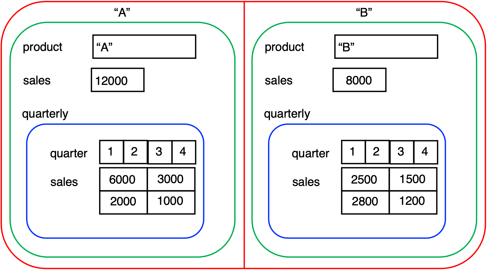
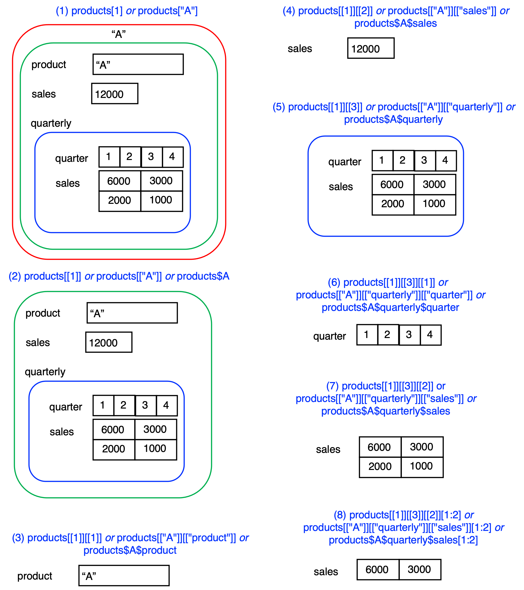

```{r setup, include=FALSE}
knitr::opts_chunk$set(echo = FALSE)
library(ggplot2)
```


## Subsetting

> R's subsetting operators are fast and powerful. Mastering them allows you to 
> succinctly perform complex operations in a way that few other languages
> can match.
>
> --- Hadley Wickham "Advanced R"
 
## Overview

* Subsetting operations allow you to process data stored in atomic vectors and lists
* R provides a range of flexible approaches that can be used to subset data.
* Learning outcomes:
  + The four main ways to subset a vector, namely, by positive integer, the minus sign, logical vectors, and vector element names.
  + The role of the `[[` operator for processing lists, and how to distinguish this from the `[`  operator.
  + The use of the `$` operator
  + How to use the `for` loop structure to iterate through a list
  + How to use the `if` statement when processing lists, and how that statement differe from the `ifelse()` function covered in Chapter Chapter \@ref(ch2).
  + Additional R functions that allow you to process vectors
  + How to solve all three test exercises.

## Atomic Vectors
* Let's model the  daily number of customers arriving at a restaurant as a *Poisson distribution*, with a mean ($\lambda$) of one hundred customers per day ($\lambda$=100). 
* The Poisson distribution describes a discrete random variable, and the mean and variance are both equal to $\lambda$
* In R, the `rpois()` function can be used to generate random numbers from a Poisson distribution, with mean ($\lambda$). 

```{r, echo =T}
# set the seed to ensure replication
set.seed(111)
# Generate the count data, assume a Poisson distribution
customers <- rpois(n = 10, lambda = 100)
names(customers) <- paste0("D",1:10)
customers
```

## Subsetting vectors - Positive Integers
* For vectors in R, the operator `[` is used to subset vectors
* Positive integers will subset atomic vector elements at given locations
* To extract the $n^{th}$ item from a vector `x` the term `x[n]` is used
* This can also apply to a sequence,  starting at `n` and finising at `m` can be extracted from the vector `x` as `x[n:m]`
* Indices can also be generated using the combine function `c()`, which is then passed in to subset a vector.
```{r,echo=T}
customers[1]

customers[1:5]

```

## Subsetting vectors - Negative Integers
* Negative integers, expressed as a vector, can be used to exclude elements from a vector
* One or more elements can be excluded

```{r,echo=T}

customers[-1]

customers[-c(1,length(customers))]

customers[-(2:(length(customers)-1))]
```


## Subsetting vectors - Logical Vectors
* Logical vectors can be used to subset a vector
* This allows for the use of relational and logical operators. 
* when a logical vector is used to subset a vector, only the corresponding cells of the logical vector element that contain `TRUE` will be retained in the operation. 

```{r}
# Create a logical vector based on a relation expression
lv <- customers > 100
lv

# Filter the original vector based on the logical vector
customers[lv]
```


* The two statements can be combined into the one expression. 

```{r, echo=T}
(customers[customers > 100])
```


## Recycling
* A nice feature of subsetting with logical vectors is that the logical vector size does not have to equal the size of the target vector. 
* When the length of the logical vector is less than the target vector, R will *recycle* the logical vector by repeating the sequence of values until all the target values have been subsetted. 

```{r,echo=T}
# Subset every third element from the vector
customers[c(TRUE,FALSE,FALSE)]
```


## Subsetting vectors - By Element Names
* If a vector has named elements - usually set via the function `names()`, then elements can subsetted through their name. 
* This is convenient if you want to retrieve an element but do not necessarily want to know its exact indexed location. 

```{r, echo=T}
customers
# Show the value from day 10
customers["D10"]

customers[c("D1","D10")]
```


## Subsetting Lists
In a similar manner to our exploration of atomic vectors, we first generate a simulated manufacturing data for two products, A and B.
```{r, echo=T} 
# A small products database. Main list has two products
products <- list(
             A=list(product="A",
                    sales=12000,
                    quarterly=list(quarter=1:4,
                               sales=c(6000,3000,2000,1000))),
             B=list(product="B",
                    sales=8000,
                    quarterly=list(quarter=1:4,
                               sales=c(2500,1500,2800,1200))))
```

## Exploring the list structure

```{r, echo=T} 
str(products)
```


## Visualising the List


```{r, ch03-products, fig.cap='Visualisation of the products data structure',echo=FALSE}

```

## Some observations on the list

* At its core, the list is simply a vector of two named elements, and this is highlighted with the red lines. 
* We can check this with R code to show (1) the length of the vector and (2) the name of each element.

```{r, echo=T} 
# Show the vector length (2 elements)
length(products)
# Show the names of each element
names(products)
```

## Some observations on the list

* However, even though there are just two elements in the list, each element has a significant internal structure. 
* Each element contains a list, highlighted in green. This list  contains three elements: 
  + the product name, a character atomic vector, 
  + the sales, a numeric atomic vector 
  + an element named quarterly, which is another list (coloured blue).
* This third list contains two atomic vector elements: 
  + the quarter number (1, 2, 3 and 4), and 
  + the corresponding sales amount for each quarter, for the product. 
* Note that the sum of the `sales` vector in this list equals the amount in the `sales` vector in the previous list.

## Subsetting lists
* Subsetting lists is more challenging than subsetting atomic vectors. 
* There are three methods that can be used, and to illustrate the core idea  we define a list (`l1`) that contains three named elements. 

```{r, echo=T}
# Create a simple list vector
l1 <- list(a="Hello",b=1:5,c=list(d=c(T,T,F),e="Hello World"))
# Show the structure
str(l1)
```


## Subsetting with `[`
* The single square bracket '[`, when applied to a list, will *always return a list*. 
* The same indexing method used for atomic vectors can also be used for filtering lists, namely: positive integers, negative integers, logical vectors, and the element name. Here are examples of filtering a list using each of these methods.

```{r, echo=T}
# extract the first element of the list
str(l1[1])
str(l1["a"])
```

## Subsetting with `[`
Some additional examples:
```{r, echo=T}
# extract the first two list elements
str(l1[1:2])
str(l1[c(T,F)])
```

## Extracting list contents with `[[`
* The single bracket `[` return a list, but in many cases this is not sufficent for analysis
* We will need to access the data within the list (which can be an atomic vector, and also a list). 
* For example, finding the value of element `a` or element `b`. 
* To do this, we must use the '[[' operator, which extracts the *contents of a list* at a given location (i.e. element 1, 2, .., N), where N is the list length.

```{r,echo=T}
# extract the contents of the first list element
l1[[1]]
l1[["a"]]
```


## Extracting list contents with `[[`
```{r, echo=T}
# extract the contents of the second  list element
l1[["b"]]

# extract the contents of the third list element (a list!)
str(l1[["c"]])
l1[["c"]][["d"]]
l1[[3]][[1]]

```

## Extracting list contents with `$`
* There is a convenient alternative to the `[[` operator, and this is the tag operator `$` which can be used once a list element is named. 
* For example, for our list `l1` the terms `l1[[1]]`, `l1[["a"]` and `l1$a` are the same, and in the general case `l[["y]]` is equivalent to `l$y`


```{r, echo=T}
l1$b

# extract the contents of the third list element (a list!)
str(l1$c)
l1$c$d
```

## Visualising subsets of `products`

```{r, ch03-subsets, fig.cap='Subsetting lists',echo=FALSE}

```


## Code for (1) - get the first list element
```{r,echo=TRUE} 
# Example (1) - get the first element of the list as a list
ex1.1 <- products[1]
ex1.2 <- products["A"]
str(ex1.1)
```


## Code for (2) - get the contents of the first list element
```{r,echo=T} 
# Example (2) - get the contents of the first list element
ex2.1 <- products[[1]] 
ex2.2 <- products[["A"]] 
ex2.3 <- products$A
str(ex2.1)
```

## Code for (3) - get the product name from the 1st list element

```{r,echo=T} 
# Example (3) - get the product name for the first product
ex3.1 <- products[[1]][[1]] 
ex3.2 <- products[["A"]][["product"]]
ex3.3 <- products$A$product
str(ex3.1)
```

## Code for (4) - get annual sales of Product A

```{r,echo=T} 
# Example (4) - get the annual sales for the first product
ex4.1 <- products[[1]][[2]] 
ex4.2 <- products[["A"]][["sales"]]
ex4.3 <- products$A$sales
str(ex4.1)
```

## Code for (5) - get the list for quarterly sales data

```{r,echo=T} 
# Example (5) - get as a list, the detailed quarterly sales
ex5.1 <- products[[1]][[3]]
ex5.2 <- products[["A"]][["quarterly"]]
ex5.3 <- products$A$quarterly
str(ex5.1)
```

## Code for (6) - get the quarters vector
```{r,echo=T} 
# Example (6) - get the quarters
ex6.1 <- products[[1]][[3]][[1]]  
ex6.1 <- products[["A"]][["quarterly"]][["quarter"]]
ex6.1 <- products$A$quarterly$quarter
str(ex6.1)
```

## Code for (7) - get the quarterly sales vector

```{r,echo=T} 
# Example (7) - get the quarterly sales
ex7.1 <- products[[1]][[3]][[2]] 
ex7.1 <- products[["A"]][["quarterly"]][["sales"]]
ex7.1 <- products$A$quarterly$sales
str(ex7.1)
```

## Code for (8) - subset the quarterly sales for product A

```{r, echo=T} 
# Example (8) - get the quarterly sales for the first two quarters
ex8.1 <- products[[1]][[3]][[2]][1:2] 
ex8.2 <-products[["A"]][["quarterly"]][["sales"]][1:2] 
ex8.3 <-products$A$quarterly$sales[1:2]
str(ex8.1)
```

## Updating and adding new elements
```{r,echo=T} 
# Increase the sales of product A by 10,000
products$A$sales <- products$A$sales + 10000
# Add a new field to product A
products$A$type <- "Food"
str(products$A)
```


## Some observations on list subsetting
* Clearly, for list manipulation, the tag operator is the most programmer-friendly, so it is recommended to use this, and also try and ensure that the list elements are named
* Indexing using `[[` by positive integer is very useful for looping structures, we will see an example of this shortly
* Functions such as those in the package `purrr` provide efficient and flexible ways to iterate through lists.

## Iteration using Loops
* Iteration is fundamental to all programming languages, and R is no exception. 
* There are a number of basic looping structures than can be used in R, and we will focus on one of these, the `for` loop. The general structure is `for(var in seq)expr, where:
  + `var` is a name for a variable that will change its value for each loop iteration
  + `seq` is an expression that evaluates to a vector   
  + `expr` which is an expression, which can be either a simple expression, or a compound expression of the form `{expr1; expr2}`, which is effectively a number of lines of code with two curly braces.
* A convenient method to iterate over a vector (a list or an atomic vector), is to use the function `seq_along()` which returns the indices of a vector. 


## Example loop structure (Atomic Vector)
```{r,echo=T}
set.seed(100)
(v <- sample(1:6,10,replace = T))
seq_along(v)
n_six <- 0
for(i in seq_along(v)){
  n_six <- n_six + as.integer(v[i] == 6)
}
n_six
```

## Example loop structure using `[[` (List)
Our goal is to find the average sales for the two products, and for this we can use a list.

```{r, echo=T}
sum_sales <- 0

for(i in seq_along(products)){
  cat("Sales of product ",i," = ",products[[i]]$sales,"\n")
  sum_sales <- sum_sales+products[[i]]$sales
}

(avr_sales <- sum_sales / length(products))

```


## The if statement
* `if(cond) expr` which evaluates `expr` if the condition `cond` is true
* `if(cond) true.expr else false.expr`, which evaluates `true.expr` if the condition is true, and otherwise evaluates `false.expr`

```{r,echo=T}
# create a test vector
v <- 1:10
lv <- vector(mode="logical",length(v))
for(i in seq_along(v)){
  if(v[i] > mean(v))
    lv[i] <- TRUE
  else
    lv[i] <- FALSE
}
v[lv]
```
## Mini-Case Star Wars Movies
* The CRAN package  `repurrrsive` is used
* It has lists on films (`sw_films`), people (`sw_people`), planets (`sw_planets`), species (`sw_species`), starships (`sw_starships`) and species (`sw_species`). 
* Here we focus on the `sw_films` list, which contains seven elements, and each element is a list that contains fourteen elements.
```{r,echo=T}
library(repurrrsive)
length(sw_films)
```

## The first movie
```{r,echo=T}
str(sw_films[1])
```

## Movie Directors for 1st and last movie
```{r,echo=T}
# Get the first film name and movie director
sw_films[[1]][[1]]
sw_films[[1]][[4]]

# Get the last film name and movie director
sw_films[[length(sw_films)]][[1]]
sw_films[[length(sw_films)]][[4]]
```

## Movie Directors for 1st and last movie
```{r,echo=T}
# Get the first film name and movie director
sw_films[[1]]$title
sw_films[[1]]$director

# Get the last film name and movie director
sw_films[[length(sw_films)]]$title
sw_films[[length(sw_films)]]$director
```


## Find all movies directed by George Lucas
* A for-loop structure (along with `seq_along()`)is used to iterate over the entire loop and mark those elements as either a match (`TRUE`) or not a match (`FALSE`). This information is stored in an atomic vector.

* Before entering the loop, we create a logical vector variable (`is_target`) of size seven (the same size as the list), and this will store information on whether a list item should be marked for further processing.

* For each list element we extract the directors name and check if it matches the target ("George Lucas"), and store this value in the corresponding element of `is_target`.

* The vector `is_target` can then be used to filter the original `sw_films` list and retain all the movies directed by George Lucas. 


## Code Solution

```{r, echo=T}
# Search for movies by George Lucas and store these in a new list
target <- "George Lucas"
# Create a logical vector that will hold information for positive matches 
is_target <- vector(mode="logical",length = length(sw_films))
# Iterate through the entire sw_films list (of 7)
for(i in seq_along(sw_films)){
  is_target[i] <- sw_films[[i]]$director == target
}
is_target
target_list <- sw_films[is_target]
length(target_list)
```

## An additional task
In this case, we look to extract the movie titles into a new data structure, in this case an atomic vector.


```{r, echo=T}
# Create a movies vector to store the movie names
movies <- vector(mode="character",
                 length = length(target_list))
# Iterate through the list to extract the movie title
for(i in seq_along(target_list)){
  movies[i]<-target_list[[i]]$title
}
movies
```

## Creating a new list
* One feature of R you will discover is that there are often may ways to achieve the same outcome. 
* For example, another way to access the movies of George Lucas would be to re-arrange the *list of lists* into a single list, where each list element is an atomic vector of values (each of size seven). 
* The process for creating the new data structure is:

  + Create a new list (`sw_films1`) of elements you wish to store (for example, movie title, episode_id  and director) from the original list. This new list initially contains empty vectors.
  + Loop through the `sw_films` list and append each movie title and director to the corresponding element of `sw_films1`

## Sample solution
```{r,echo=T}
sw_films1 <- list(title=c(), episode_id=c(), director=c())
for(i in seq_along(sw_films)){
  sw_films1$title      <- c(sw_films1$title,
                            sw_films[[i]]$title)
  sw_films1$episode_id <- c(sw_films1$episode_id,
                            sw_films[[i]]$episode_id)
  sw_films1$director   <- c(sw_films1$director,
                            sw_films[[i]]$director)
}
str(sw_films1)
```

## Parallel Vectors
* Notice that we now have one list, and this list has three elements, each an atomic vector of size seven.
* These can be viewed as *parallel vectors*, where each vector is the same size, and the i-th element of each vector are related.  
* This feature can be exploited to filter related atomic vectors using logical vector subsetting.

```{r,echo=T}
cat(sw_films1$title[1],"-",sw_films1$episode_id[1],"-",
    sw_films1$director[1],"\n")

sw_films1$title[sw_films1$director=="George Lucas"]
```


## Useful R Functions 
| R Function       | Description                                                                    |
| :---             | :---                                                                           |
| `as.list()`      | Coerces the input argument into a list.                                        |
| `paste0()`       | Converts arguments to character strings and then concatenates (with no spaces) |
| `rpois()`        | Generates up to n random numbers from a Poisson distribution with mean lambda  |
| `seq_along()`    | Generates a regular sequence that can be used to iterate over vectors          |
| `which()`        | Give the TRUE indices of a logical object                                      |


## Exercise 1
* Filter the list `sw_people` (87 elements), contained in `repurrrsive` to include only those whose height is *not unknown*, and name this list `sw_people1`.
* Use an atomic vector `has_height` to filter the list, and populate this vector using a loop structure. 
* This new list (`sw_people1`) should have 81 elements. 

```{r, echo=FALSE}
has_height <- vector(mode="logical",length=length(sw_people))
for(i in seq_along(sw_people)){
  has_height[i] <- sw_people[[i]]$height != "unknown"
}
sw_people1 <- sw_people[has_height]
```


```{r,echo=T}
sum(has_height)
length(sw_people1)
```


## Exercise 2
* Using a `for` loop over the filtered list `sw_people1` from exercise 2, create a list of people whose height is greater than or equal to 225 inches. 
* The resulting vector should grow as matches are found, as we do not know in advance how many people will be contained in the result. 
* Use the command `characters <- c()` to create the initial empty result vector. 
* The `if` expression may be useful here too, and make sure that the height value is converted to a numeric value before evaluating.

```{r, echo=FALSE}
characters <- c()

for(i in seq_along(sw_people1)){
  if(as.numeric(sw_people1[[i]]$height) >= 225){
    characters <- c(characters,sw_people1[[i]]$name)
  }
}
```

The following result should be obtained.

```{r, echo=T}
# These are the characters whose height is >= 225
characters
```


## Exercise 3
* Based on the list `sw_species`, and given that each species has a `classification`, create the following tabular summary, again using a loop to iterate through the list. 
* Make use of the `table()` function

```{r, echo=FALSE}
c_species <- vector(mode="character",length=length(sw_species))
for(i in seq_along(sw_species)){
  c_species[i] <- sw_species[[i]]$classification
}
t_species <- table(c_species)
```

```{r, echo=T}
# A tabular summary of the types of species
t_species

```


## Lecture Summary
* The four main ways to subset a vector, namely, by positive integer, the minus sign, logical vectors, and vector element names.
* The role of the `[[` operator for processing lists, and how to distinguish this from the `[`  operator.
* The use of the `$` operator
* How to use the `for` loop structure to iterate through a list
* How to use the `if` statement when processing lists, and how that statement differs from the `ifelse()` function
* Additional R functions that allow you to process vectors
* How to solve all three test exercises.
