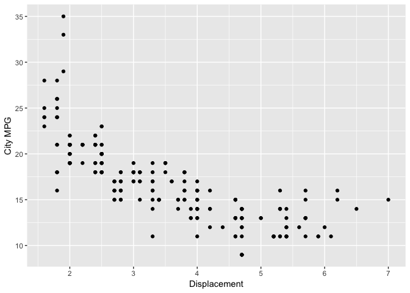
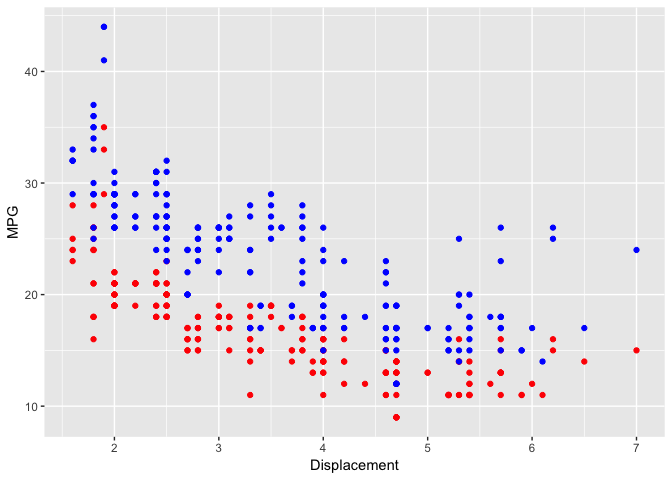
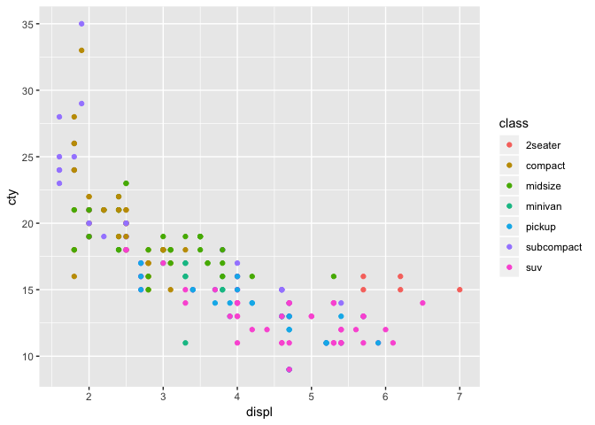
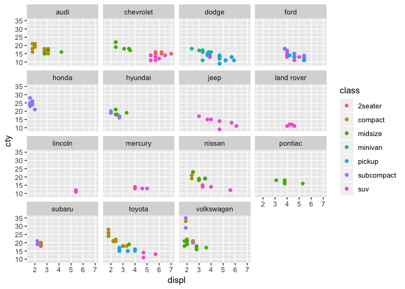
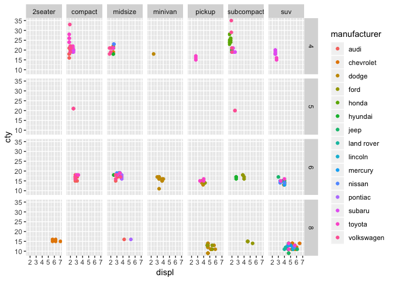
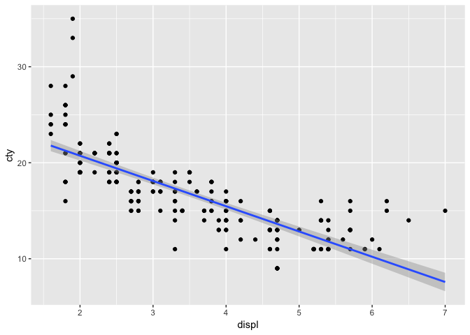
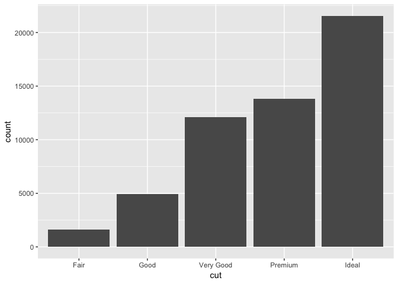
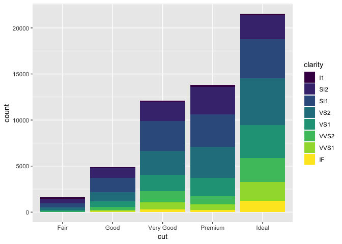
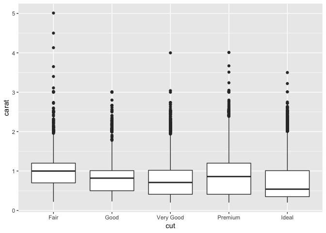

Lecture 5 (ggplot2) - Summary
================

<!-- README.md is generated from README.Rmd. Please edit that file -->
Here are some of the key points from the lecture. See also the sample code solutions in the code folder.

-   To show the workings of ggplot2, we will use the mpg dataset, and the tibble library.

``` r
library(ggplot2)
library(tibble)

glimpse(mpg)
```

    ## Observations: 234
    ## Variables: 11
    ## $ manufacturer <chr> "audi", "audi", "audi", "audi", "audi", "audi", "...
    ## $ model        <chr> "a4", "a4", "a4", "a4", "a4", "a4", "a4", "a4 qua...
    ## $ displ        <dbl> 1.8, 1.8, 2.0, 2.0, 2.8, 2.8, 3.1, 1.8, 1.8, 2.0,...
    ## $ year         <int> 1999, 1999, 2008, 2008, 1999, 1999, 2008, 1999, 1...
    ## $ cyl          <int> 4, 4, 4, 4, 6, 6, 6, 4, 4, 4, 4, 6, 6, 6, 6, 6, 6...
    ## $ trans        <chr> "auto(l5)", "manual(m5)", "manual(m6)", "auto(av)...
    ## $ drv          <chr> "f", "f", "f", "f", "f", "f", "f", "4", "4", "4",...
    ## $ cty          <int> 18, 21, 20, 21, 16, 18, 18, 18, 16, 20, 19, 15, 1...
    ## $ hwy          <int> 29, 29, 31, 30, 26, 26, 27, 26, 25, 28, 27, 25, 2...
    ## $ fl           <chr> "p", "p", "p", "p", "p", "p", "p", "p", "p", "p",...
    ## $ class        <chr> "compact", "compact", "compact", "compact", "comp...

-   ggplot2 works in layers, with data and mapping. The data must be in a tibble/data frame. Mappings involved the aes() function and map variables onto plot features. A simple example is shown below.

``` r
ggplot(data=mpg) + geom_point(aes(x=displ,y=cty))+ylab("City MPG")+xlab("Displacement")
```



-   Point colours can be set directly as part of geom\_point. We can also layer plots on one another, for example, showing the different between city MPG and highway MPG.

``` r
ggplot(data=mpg) + geom_point(aes(x=displ,y=cty), colour="red")+
  geom_point(aes(x=displ,y=hwy), colour="blue")+
  ylab("MPG")+xlab("Displacement")
```



-   The aes() function can also be used to colour points (automatically) by category. Note that the colour parameter is inside the aes() function. This is important!

``` r
ggplot(data=mpg) + geom_point(aes(x=displ,y=cty,colour=class))
```



-   Facets can alse be used to explore data, by splitting the graphs out into new categories

``` r
ggplot(data=mpg) + geom_point(aes(x=displ,y=cty,colour=class))+facet_wrap(~manufacturer)
```



-   Facets can alse be used in a grid fashion for two categorical variables.

``` r
ggplot(data=mpg) + geom_point(aes(x=displ,y=cty,colour=manufacturer))+facet_grid(cyl~class)
```



-   Statistical models can also be layered on a graph

``` r
ggplot(data=mpg, aes(x=displ,y=cty))+geom_point()+geom_smooth(method = "lm")
```



-   To show further plots, the dataset ggplot2::diamonds is used

``` r
glimpse(diamonds)
```

    ## Observations: 53,940
    ## Variables: 10
    ## $ carat   <dbl> 0.23, 0.21, 0.23, 0.29, 0.31, 0.24, 0.24, 0.26, 0.22, ...
    ## $ cut     <ord> Ideal, Premium, Good, Premium, Good, Very Good, Very G...
    ## $ color   <ord> E, E, E, I, J, J, I, H, E, H, J, J, F, J, E, E, I, J, ...
    ## $ clarity <ord> SI2, SI1, VS1, VS2, SI2, VVS2, VVS1, SI1, VS2, VS1, SI...
    ## $ depth   <dbl> 61.5, 59.8, 56.9, 62.4, 63.3, 62.8, 62.3, 61.9, 65.1, ...
    ## $ table   <dbl> 55, 61, 65, 58, 58, 57, 57, 55, 61, 61, 55, 56, 61, 54...
    ## $ price   <int> 326, 326, 327, 334, 335, 336, 336, 337, 337, 338, 339,...
    ## $ x       <dbl> 3.95, 3.89, 4.05, 4.20, 4.34, 3.94, 3.95, 4.07, 3.87, ...
    ## $ y       <dbl> 3.98, 3.84, 4.07, 4.23, 4.35, 3.96, 3.98, 4.11, 3.78, ...
    ## $ z       <dbl> 2.43, 2.31, 2.31, 2.63, 2.75, 2.48, 2.47, 2.53, 2.49, ...

-   Bar charts can process observations to produce overall numeric counts

``` r
ggplot(data=diamonds, aes(x=cut))+geom_bar()
```



-   These can be viewed by categories (e.g. using fill=clarity)

``` r
ggplot(data=diamonds, aes(x=cut,fill=clarity))+geom_bar()
```



-   Boxplots can also be drawn

``` r
ggplot(data=diamonds, aes(x=cut,y=carat))+geom_boxplot()
```



**Additional Examples**

-   [Top 50 ggplot2 Visualizations](http://r-statistics.co/Top50-Ggplot2-Visualizations-MasterList-R-Code.html)
-   [Exploration of MPG Dataset by Shailesh Kumar](https://rpubs.com/shailesh/mpg-exploration)
-   [R Cookbook by Winston Chang](http://www.cookbook-r.com/Graphs/)
